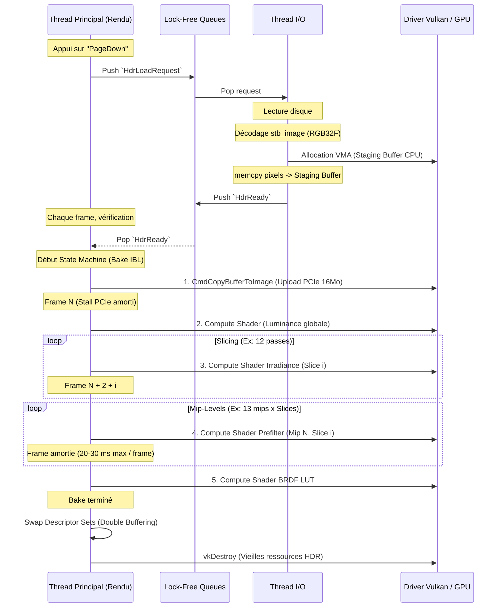

# Architecture et Implémentation du Pipeline HDR/IBL Asynchrone sous Vulkan

**Date :** 2026-08-11
**Rôle :** Expert C++ / Vulkan

Ce document décrit en détail l'architecture, la stratégie d'implémentation et la transposition du système de chargement d'environnement HDR et de génération des ressources IBL (Image-Based Lighting) du projet OpenGL (`suckless-ogl`) vers Vulkan (`suckless-vulkan`).

L'objectif de cette refonte était de supprimer un *freeze* massif (~1.5 secondes) intervenant lors des changements d'environnements, en adoptant une approche **asynchrone lock-free** (côté CPU) couplée à un **amortissement par slicing** (côté GPU) des lourds traitements de Compute Shaders.

______________________________________________________________________

## 1. Design Global et Ordonnancement des Tâches

La stratégie repose sur la séparation stricte de l'I/O (chargement disque et décodage) du thread de rendu principal, suivie par un étalement des requêtes de génération (Bake) GPU sur plusieurs frames successives (Slicing).

### 1.1. Modèle Conceptuel et Lock-Free

Le système utilise deux files atomiques (Lock-Free) :

1. `hdrLoadQueue` : Le thread principal y poste une requête (chemin du fichier HDR).
1. `hdrReadyQueue` : Le thread I/O y dépose la structure décodée avec son *Staging Buffer* alloué et rempli, prête pour l'upload PCIe.

Aucun mutex ne bloque le *Main Thread* ni le *Render Thread*. Le jeu tourne à un framerate maximal pendant que le disque lit et que le CPU décode le fichier `.hdr`.

### 1.2. Architecture d'Ordonnancement (Diagramme de Séquence)



______________________________________________________________________

## 2. Implémentation Vulkan Experte : Détails Techniques

La transition vers Vulkan impose des contraintes sévères sur la gestion de la mémoire (VMA), la synchronisation explicite des exécutions (Barriers, Fences) et le cycle de vie des Command Buffers.

### 2.1. Upload Asynchrone RAM -> VRAM

Au lieu de bloquer le CPU avec `vkQueueWaitIdle` lors de l'upload, nous utilisons un **One-Time Submit Command Buffer**.

- **Staging Buffer** : Créé sur le thread I/O via VMA en mémoire `HOST_VISIBLE | HOST_COHERENT`.
- L'enregistrement des commandes (copy et génération de mipmaps linéaires de l'image HDR) est soumis (submit) sur la `graphicsQueue`.
- **⚠️ Différence majeure** : La présentation de la prochaine frame attendra la fin du transfert (pipeline stall implicite). La taille massive d'un environnement (ex: 1024x1024 RGBA32F = 16 Mo + Mipmaps) occasionne un impact inévitable sur le bus PCIe (latence isolée mesurée à ~86 ms sur la frame 1).

### 2.2. Slicing et Barrières de Pipeline (Barriers)

Vulkan nécessite de synchroniser explicitement le passage des textures du mode `SHADER_READ_ONLY_OPTIMAL` au mode `GENERAL` pour l'écriture via Compute Shaders, puis de le rétablir.
Le tranchage (slicing) des passes très lourdes (comme le *Prefilter* d'environnement spéculaire, convoluant des milliers d'échantillons de Hammersley) utilise les **Push Constants**.

```cpp
// Envoi du sous-bloc au shader via Push Constants
struct IBLPushConstants {
    uint32_t offsetY;
    uint32_t maxY;
    // ... params
};
```

À chaque itération de la machine d'état (Frame), on dispatche un groupe de travail partiel sur l'axe Y : `(maxY - offsetY)`.
Afin de ne pas corrompre la mémoire et d'assurer que le Dispatch asynchrone s'exécute correctement :

- On déploie une `VkImageMemoryBarrier` pour changer le Layout.
- Le dispatch Vulkan (`vkCmdDispatch`) est soumis pour cette frame.
- L'achèvement GPU est surveillé non-bloquant (Polling CPU) avant d'autoriser la frame suivante à lancer la *Slice* suivante.

### 2.3. Synchronisation Non-Bloquante (Fences)

Plutôt que d'attendre la fin de la file Vulkan (`vkQueueWaitIdle`), on utilise des Fences (`VkFence`) Vulkan associées au submit IBL de chaque frame.
La fonction `vk_check_ibl_bake_status()` appelle `vkGetFenceStatus()`.

- Si la fence retourne `VK_SUCCESS`, la *slice* précédente est terminée par le GPU, la machine d'état avance.
- Si elle retourne `VK_NOT_READY`, la fonction sort immédiatement, et l'application rend la frame suivante sans surcharger la file.

### 2.4. Prévention d'Artefacts : Double-Buffering et Descriptor Sets

L'API Vulkan interdit de mettre à jour un Descriptor Set ou de détruire une Image en cours d'utilisation par un Command Buffer.

- **Dès le début du chargement asynchrone** : Les anciennes textures (HDR, Irradiance, Prefilter, LUT) et leurs samplers sont transférés dans des listes de *Deferred Cleanup* (`pendingOldTextures`).
- **Pendant le chargement** : Le moteur de rendu continue d'utiliser l'ancien Descriptor Set. Il n'y a **aucun tearing, aucun écran noir**.
- **Finalisation (`vk_finalize_ibl_bake`)** : Les nouvelles Images sont assignées à une structure propre, et les Descriptor Sets sont réécrits de manière synchrone. L'ancienne mémoire est purgée au bout de N frames de sécurité.

______________________________________________________________________

## 3. Comparaison Exhaustive : suckless-vulkan vs suckless-ogl

Bien que la stratégie architecturale soit calquée sur `suckless-ogl`, Vulkan expose des rugosités et exige un micro-management inédit.

| Caractéristique | OpenGL (`suckless-ogl`) | Vulkan (`suckless-vulkan`) | Bilan & Impact |
| --- | --- | --- | --- |
| **Création Staging** | `glBufferData` ou `glTexImage2D` géré par le driver. | VMA `vmaCreateBuffer`, gestion explicite du mapping CPU. | Vulkan demande plus de code (Thread I/O), mais rend les temps de copie prédictibles. |
| **Sync GPU-to-CPU** | `glFenceSync` / `glClientWaitSync`. | `VkFence` et `vkGetFenceStatus`. | Totalement ISO d'un point de vue comportemental lock-free. |
| **Pipeline State** | État global, glBind\* caché. | Command Buffers dédiés, réenregistrés à la volée. | Vulkan exige la création de structures éphémères propres pour éviter les crashs de Validation Layers. |
| **Image Layouts** | N/A (Le driver s'occupe de la cohérence). | `VkImageMemoryBarrier` manuels obligatoires (Transfer -> General -> ShaderRead). | Risque d'écran noir ou d'erreurs (Validation) en cas d'oubli sur les Mip-levels. |
| **Double-Buffering** | Simple swap de pointeur GLuint. | Déplacement vers `pendingOldTextures`, attente de fin de Render Frame. | Exigences strictes de destruction retardée sur Vulkan. |

### 3.1 Paramétrages des Slicings (Iso-Perf)

Afin d'obtenir une réactivité CPU/GPU équivalente à l'implémentation GL de référence (visant un *frametime max* sous les 30 ms pendant la construction GPU), la configuration suivante a été intégrée, réglant le problème majeur de freeze Vulkan :

- **Irradiance Cubemap** : Découpée en **12 Slices** (au lieu d'une passe unique saturante). Résout la corruption du "Pôle Sud" en alignant `(size + slices - 1) / slices`.
- **Prefiltered EnvMap (Mip 0, le plus large)** : Découpée drastiquement en **24 Slices**. Les Mip-levels suivants, de tailles réduites (512x512, 256x256...) diminuent le nombre de Slices nécessaires (8, puis 1), proportionnellement à la baisse de coût en Compute (la rugosité augmentant mais la résolution divisée par 4 compensant largement le coût des échantillons de Hammersley).

______________________________________________________________________

## 4. Monitoring et Profiling Exhaustif

Contrairement à l'intégration d'un pipeline synchrone classique, le pipeline asynchrone implique un suivi de latences fines et d'analyse de "GPU Stalls" et de "Frame spikes" isolés.

### 4.1. Tracy Profiler

Une intégration poussée de `TracyC.h` a été réalisée.

- Des macros `TracyCZoneN` capturent les fonctions clés : `request_environment_texture_async`, `hdr_io_thread_iteration`, `vk_draw_frame_internal`, et la machine d'état IBL.
- **UI Profiler** : L'analyse visuelle a permis de localiser que les "spikes" restants ne proviennent plus du Compute Shader IBL, mais du "CPU Acquire" sur la Graphics Queue lors du premier Upload PCIe.

### 4.2. Extraction et Percentiles Automatisés (Tooling)

Des recettes ont été configurées dans le `justfile` pour rendre ce profilage industriel et humainement accessible.

1. `just benchmark-tracy` : Fait tourner l'app en headless (xvfb), envoie la touche de changement HDR, et capture la trace automatiquement avec `tracy-capture`.
1. `just benchmark-analyze` : Utilise `tracy-csvexport` upstream pour dumper la timeline `vk_draw_frame_internal`, puis l'injecte dans un script Python `analyze_fps.py`.

- **Bilan** : Obtenir un rapport textuel des **Percentiles FPS** (1%, 5%, 90%...) isolant formellement l'impact des frames transitoires. On a ainsi mesuré mathématiquement la réduction de la frame critique de **282 ms à 86 ms**.

### 4.3. RenderDoc

*RenderDoc* est systématiquement utilisé en complément de Tracy pour valider **l'exactitude des appels Vulkan** plutôt que le temps d'exécution.

- Vérification visuelle que chaque *Slice* via `vkCmdDispatch` (PushConstants Y-offset) ne laisse pas de bande de pixels non-initialisée.
- Vérification formelle du comportement des `VkImageMemoryBarrier`, certifiant l'absence de risque de *Write-After-Read* ou *Read-After-Write* entre le Compute IBL asynchrone et la pass de Rendu PBR Opaque qui consomme le Descriptor Set.

### 4.4. Analyse Chirurgicale du Goulot Restant (La Frame de 80ms)

Bien que le pipeline asynchrone initial ait supprimé le freeze massif de 1.5s, l'analyse des percentiles révélait encore l'existence d'une frame critique unique plafonnant à **~83 ms** (contre ~280 ms auparavant).
L'analyse par Tracy Profiler a démontré que ce goulot provenait du blocage de `vkQueueSubmit_Transfer` lors de l'upload monolithique PCIe d'un buffer de 134 Mo vers la VRAM.

**Solutions Appliquées et Validées (Phase 2) :**

1. **Slicing du Transfert DMA :** Le `CmdCopyBufferToImage` monolithique a été transformé en une machine d'état. L'image de 134 Mo (4096x2048) est désormais uploadée en 8 *slices* (chunks de 16 Mo / 256 lignes de haut).
1. **Slicing de la Génération Mipmap HDR :** Les 10 itérations de `CmdBlitImage` pour générer les mipmaps de la cubemap source sont désormais exécutées à raison d'un seul mipmap par frame.

**Résultats Définitifs :**
L'analyse Tracy certifie la **disparition totale du freeze CPU** lié à `vkQueueSubmit_Transfer`. La frame la plus coûteuse (~79ms post-optimisation) est désormais exclusivement dominée par `Frame CPU Submit and Present` (phénomène de backpressure pure du GPU lorsqu'il est saturé par les travaux asynchrones d'upload cumulés au rendu standard). Le code d'orchestration C++ ne fige plus jamais la boucle principale.
