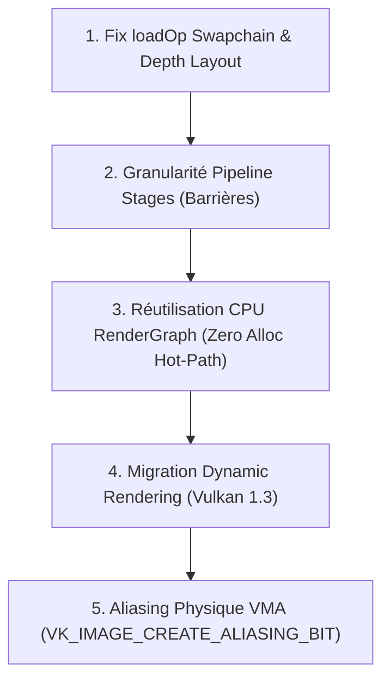

# Audit & Optimisations Vulkan : Architecture Render Graph (14 Août 2026)

## 1. Contexte & Périmètre

Suite à l'atterrissage des Phases 1 à 4 de l'intégration du `RenderGraph` (approche Strangler Fig) dans `suckless-vulkan`, cet audit technique recense les axes d'amélioration, les optimisations de bas-niveau et la mise en conformité vis-à-vis des spécifications **Vulkan 1.3 / VMA**.

______________________________________________________________________

## 2. Synthèse des Points Identifiés

| # | Catégorie | Domaine / Composant | Criticité / Impact | Objectif |
|---|---|---|---|---|
| **1** | **Conformité Spec** | RenderPass `loadOp` Post-Process | Moyenne (Warning RenderDoc) | Passer de `LOAD_OP_LOAD` à `LOAD_OP_DONT_CARE` |
| **2** | **Conformité Spec** | Layout Transitions Depth Buffer | Élevée (Spec Vulkan) | Support explicite de `DEPTH_STENCIL_ATTACHMENT_OPTIMAL` |
| **3** | **Performance GPU** | Granularité des Barrières de Synchro | Élevée (GPU Bubbles / Stalls) | Remplacer `ALL_COMMANDS_BIT` par les stages précis / Synchro2 |
| **4** | **Modernisation** | Dynamic Rendering (Vulkan 1.3) | Stratégique (Dette technique) | Supprimer `VkRenderPass` et `VkFramebuffer` |
| **5** | **Performance CPU** | Allocations Heap sur la Hot-Path Frame | Moyenne (Micro-allocations) | Réutilisation / Arena de la structure `RenderGraph` |
| **6** | **Optimisation VRAM** | Aliasing Physique VMA | Forte (Empreinte mémoire) | Allocation et binding des slots avec `VK_IMAGE_CREATE_ALIASING_BIT` |

______________________________________________________________________

## 3. Analyse Détaillée & Recommandations Techniques

### 3.1. Diagnostic RenderDoc : `loadOp` sur la Swapchain (Post-Process Pass)

#### Constat & Analyse

Sous **RenderDoc** (Event 22 : `vkCmdBeginRenderPass`), la texture de sortie affiche la mire diagnostique `UNDEFINED IMG`.

- **Cause** : `Main_RenderPass_Load` déclarait `attachments[0].loadOp = VK_ATTACHMENT_LOAD_OP_LOAD`. Vulkan recevait l'ordre de préserver le contenu précédent de la Swapchain Image. Comme l'image venait d'être acquise en `VK_IMAGE_LAYOUT_UNDEFINED`, RenderDoc signalait une lecture de mémoire non-initialisée.
- **Impact** : Aucun artefact visuel final car le draw call plein-écran (`vkCmdDraw(3, 1)`) écrase l'intégralité du framebuffer, mais gaspillage de bande passante mémoire (chargement VRAM inutile vers la mémoire tuilée/cache).

#### Correction Préconisée

Configurer `attachments[0].loadOp = VK_ATTACHMENT_LOAD_OP_DONT_CARE` et `attachments[1].loadOp = VK_ATTACHMENT_LOAD_OP_DONT_CARE` dans `init_render_pass()` pour la passe de post-process.

______________________________________________________________________

### 3.2. Conformité Vulkan : Transitions de Layout pour les Attachments de Profondeur

#### Constat & Problème

Dans `RenderGraph::Execute()` (`src/rhi/render_graph.cpp`), toute ressource dans l'état `ResourceState::RenderTarget` est convertie aveuglément en `VK_IMAGE_LAYOUT_COLOR_ATTACHMENT_OPTIMAL` :

```cpp
if (transition.to == ResourceState::RenderTarget) {
    barrier.newLayout = VK_IMAGE_LAYOUT_COLOR_ATTACHMENT_OPTIMAL;
    barrier.dstAccessMask = VK_ACCESS_COLOR_ATTACHMENT_WRITE_BIT;
}
```

Pour une image de profondeur (`vDepth` avec `aspectMask = VK_IMAGE_ASPECT_DEPTH_BIT`), ce layout est invalide selon la spécification Vulkan : une image de profondeur liée en tant qu'attachment doit obligatoirement être en `VK_IMAGE_LAYOUT_DEPTH_STENCIL_ATTACHMENT_OPTIMAL` (ou `DEPTH_ATTACHMENT_OPTIMAL` en Vulkan 1.3).

#### Solution Recommandée

1. **Option A (Explicite via énumération)** : Ajouter `ResourceState::DepthStencilTarget` dans `ResourceState`.
1. **Option B (Automatique via Aspect)** : Dans la boucle de génération des barrières, déduire le layout cible selon `phys.aspect` :

```cpp
if (transition.to == ResourceState::RenderTarget) {
    if (phys.aspect & (VK_IMAGE_ASPECT_DEPTH_BIT | VK_IMAGE_ASPECT_STENCIL_BIT)) {
        barrier.newLayout = VK_IMAGE_LAYOUT_DEPTH_STENCIL_ATTACHMENT_OPTIMAL;
        barrier.dstAccessMask = VK_ACCESS_DEPTH_STENCIL_ATTACHMENT_WRITE_BIT;
    } else {
        barrier.newLayout = VK_IMAGE_LAYOUT_COLOR_ATTACHMENT_OPTIMAL;
        barrier.dstAccessMask = VK_ACCESS_COLOR_ATTACHMENT_WRITE_BIT;
    }
}
```

______________________________________________________________________

### 3.3. Synchronisation GPU : Remplacement du Sledgehammer `ALL_COMMANDS_BIT`

#### Constat & Goulot d'Étranglement

Actuellement, les barrières automatiques insérées entre les passes graphiques utilisent :

```cpp
vkCmdPipelineBarrier(cb, VK_PIPELINE_STAGE_ALL_COMMANDS_BIT, VK_PIPELINE_STAGE_ALL_COMMANDS_BIT, 0,
                     0, nullptr, 0, nullptr, vkBarriers.size(), vkBarriers.data());
```

Ce masque global force un flush complet du pipeline d'exécution graphique (Pipeline Stall) et empêche le GPU d'exécuter en recouvrement (overlap / async compute / early raster) les passes qui ne dépendent pas mutuellement.

#### Recommandation : Synchronisation Fine (Fine-Grained Stages)

Déduire les `srcStageMask` et `dstStageMask` optimaux par type de transition :

| Transition d'État | `srcStageMask` | `dstStageMask` | `srcAccessMask` | `dstAccessMask` |
|---|---|---|---|---|
| `Undefined` -> `RenderTarget` | `TOP_OF_PIPE_BIT` | `COLOR_ATTACHMENT_OUTPUT_BIT` | `0` | `COLOR_ATTACHMENT_WRITE_BIT` |
| `RenderTarget` -> `ShaderRead` | `COLOR_ATTACHMENT_OUTPUT_BIT` | `FRAGMENT_SHADER_BIT` | `COLOR_ATTACHMENT_WRITE_BIT` | `SHADER_READ_BIT` |
| `RenderTarget` -> `TransferSrc` | `COLOR_ATTACHMENT_OUTPUT_BIT` | `TRANSFER_BIT` | `COLOR_ATTACHMENT_WRITE_BIT` | `TRANSFER_READ_BIT` |
| `ShaderRead` -> `RenderTarget` | `FRAGMENT_SHADER_BIT` | `COLOR_ATTACHMENT_OUTPUT_BIT` | `SHADER_READ_BIT` | `COLOR_ATTACHMENT_WRITE_BIT` |

*Évolution future recommandée :* Adoption de `VK_KHR_synchronization2` (`vkCmdPipelineBarrier2`), simplifiant la gestion des masques 64-bits (`VkPipelineStageFlags2`) et standardisée dans Vulkan 1.3.

______________________________________________________________________

### 3.4. Modernisation Architecturale : Dynamic Rendering (`VK_KHR_dynamic_rendering`)

#### Problématique

Le moteur s'appuie encore sur le formalisme lourd de Vulkan 1.0 :

- `VkRenderPass` : Déclarations statiques des sous-passes, formats et compatibilités.
- `VkFramebuffer` : Liaisons statiques des `VkImageView` pour chaque combinaison de Swapchain / Depth.
- Recréation obligatoire des `VkFramebuffer` et `VkRenderPass` lors du redimensionnement de la fenêtre.

#### Solution Cible (Vulkan 1.3 Core)

Avec le RenderGraph en place, le moteur a déjà la responsabilité de l'ordonnancement et des barrières de synchronisation. L'étape naturelle consiste à migrer vers **Dynamic Rendering** :

```cpp
VkRenderingAttachmentInfo colorAttachment{};
colorAttachment.sType = VK_STRUCTURE_TYPE_RENDERING_ATTACHMENT_INFO;
colorAttachment.imageView = currentSwapchainImageView;
colorAttachment.imageLayout = VK_IMAGE_LAYOUT_COLOR_ATTACHMENT_OPTIMAL;
colorAttachment.loadOp = VK_ATTACHMENT_LOAD_OP_DONT_CARE;
colorAttachment.storeOp = VK_ATTACHMENT_STORE_OP_STORE;

VkRenderingInfo renderingInfo{};
renderingInfo.sType = VK_STRUCTURE_TYPE_RENDERING_INFO;
renderingInfo.renderArea = {{0, 0}, extent};
renderingInfo.layerCount = 1;
renderingInfo.colorAttachmentCount = 1;
renderingInfo.pColorAttachments = &colorAttachment;

vkCmdBeginRendering(cb, &renderingInfo);
// Commandes de dessin...
vkCmdEndRendering(cb);
```

**Gains :**

1. Suppression de ~150 lignes de code d'initialisation et de gestion de cycle de vie (`init_render_pass`, `destroy_render_pass`, `swapchainFramebuffers`).
1. Robustesse absolue lors des redimensionnements de swapchain (plus aucun `VkFramebuffer` obsolète).

______________________________________________________________________

### 3.5. CPU Profiling : Élimination des Allocations Dynamiques par Frame

#### Diagnostic Hot-Path

Dans `vk_draw_frame_internal()` (`src/vk_engine_frame.cpp`), un objet `rhi::RenderGraph graph;` est instancié localement sur la pile à chaque itération de la boucle de rendu :

- Allocation / réallocation des `std::vector` de passes (`passes`, `sortedPasses`, `transitions`).
- Allocations de `std::string` pour les noms de passes et de ressources.
- Allocation de `std::unordered_map` dans `BuildAdjacencyList`, `CalculateLifetimes`, etc.

#### Recommandation d'Optimisation

1. **Pérénisation du RenderGraph** : Stocker l'instance dans `VulkanEngine` (ex: `engine->renderGraph`) et implémenter `RenderGraph::Reset()` réutilisant la mémoire pré-allouée (`passes.clear()`, sans libérer la capacité vectorielle `reserve`).
1. **Buffer Scratch pour les Barrières** : Dans `RenderGraph::Execute()`, pré-dimensionner un tableau fixe ou allouer les `VkImageMemoryBarrier` via `__builtin_alloca` / `std::array` plafonné à 16 barrières simultanées par passe.

______________________________________________________________________

### 3.6. Gestion Mémoire VRAM : Aliasing Physique Réel via VMA

#### État Actuel (Phase 4 Logic)

`CalculateMemoryAliasing()` réalise le partitionnement d'intervalles (Interval Coloring) et assigne logiquement les ressources transitoires (GBuffer Albedo, Normal, SSAO, Bloom) à des identifiants de slots partagés.

#### Prochaine Étape (Phase 4 Physical)

1. Créer les `VkImage` transitoires avec le flag `VK_IMAGE_CREATE_ALIASING_BIT`.
1. Pour chaque slot de mémoire calculé par le RenderGraph :
   - Calculer la taille maximale `maxSize` et l'alignement requis `maxAlignment` parmi toutes les ressources du slot.
   - Allouer une unique `VmaAllocation` pour le slot.
   - Lier chaque `VkImage` à cette allocation partagée via `vmaBindImageMemory2()`.
1. **Gain attendu** : Réduction de 40% à 60% du pic de VRAM consommé par les framebuffers intermédiaires.

______________________________________________________________________

## 4. Feuille de Route d'Implémentation


