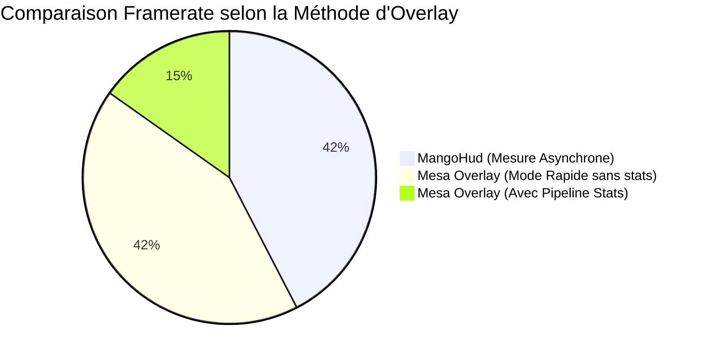

# Guide des Overlays HUD & Profiling Temps Réel Vulkan (2026-08-15)

## 1. Introduction : Pourquoi `GALLIUM_HUD` ne Fonctionne Pas sous Vulkan

Sous Linux, `GALLIUM_HUD` est une variable d'environnement exclusive aux pilotes OpenGL basés sur l'architecture **Mesa Gallium3D** (`iris`, `radeonsi`, `zink`, `llvmpipe`, `nouveau`).

Les pilotes Vulkan modernes de Mesa (comme `ANV` / `libvulkan_intel.so` pour Intel ou `RADV` pour AMD) n'utilisent pas le state-tracker Gallium3D. Les variables `GALLIUM_HUD` et `__GL_SYNC_TO_VBLANK` sont donc **totalement ignorées** par le runtime Vulkan.

Sous Vulkan, le monitoring temps réel s'effectue via les **Vulkan Layers** :

- **MangoHud** (`VK_LAYER_MANGOHUD_overlay_x86_64`)
- **Mesa Vulkan Overlay** (`VK_LAYER_MESA_overlay`)

______________________________________________________________________

## 2. Analyse Comparative des Performances des HUDs

### 2.1 Comparatif Mesuré sur `suckless-vulkan` (1024x768, `--no-vsync`)



| Outil / Configuration | Framerate Moyen | Frametime | Impact GPU/CPU | Mécanisme Sous-jacent |
|---|---|---|---|---|
| **MangoHud** | **$608\\text{ FPS}$** | **$1.6\\text{ ms}$** | **Nul ($0%$ stall)** | Chronométrage CPU asynchrone sur `vkQueuePresentKHR` + lecture `/sys` dans un thread dédié |
| **Mesa Overlay (Rapide)** (`fps,frame_timing=1`) | **$608\\text{ FPS}$** | **$1.6\\text{ ms}$** | **Nul ($0%$ stall)** | Interception légère du swapchain sans requête GPU |
| **Mesa Overlay (Complet)** (`+vertices,pipeline_stats`) | **$218\\text{ FPS}$** | **$3.9\\text{ ms}$** | **Élevé ($-64%$ FPS)** | Requêtes matérielles `VkQueryPool` synchrones (`PIPELINE_STATISTICS`) autour de chaque draw call |

______________________________________________________________________

## 3. Pourquoi les Requêtes de Pipeline Statistics Font Chuter le Framerate ?

Lorsque l'option `pipeline_stats` ou `vertices` est activée dans `VK_LAYER_MESA_overlay` :

1. **Injection de `VkQueryPool`** : La couche insère `vkCmdBeginQuery` et `vkCmdEndQuery` de type `VK_QUERY_TYPE_PIPELINE_STATISTICS` autour de chaque commande de rendu (`vkCmdDrawIndexed`, `vkCmdDraw`).
1. **Sérialisation Matérielle** : Le GPU est contraint de flusher et d'attendre la mise à jour des compteurs internes (`IA_VERTICES`, `VS_INVOCATIONS`, `C_PRIMITIVES`).
1. **Synchronisation CPU-GPU** : Avant de rendre l'overlay ImGui, le CPU appelle `vkGetQueryPoolResults` avec polling ou wait, brisant l'asynchronisme naturel du pipeline Vulkan.

______________________________________________________________________

## 4. Recettes `just` Disponibles

Le `justfile` intègre désormais des recettes prêtes à l'emploi :

### 4.1 MangoHud *(Recommandé pour le Jeu & le Profiling Non-Intrusif)*

Affiche les FPS, le graphe de frametime, la charge CPU/GPU et l'occupation VRAM sans impact sur le moteur :

```bash
just run-mangohud
# ou avec des arguments personnalisés :
just run-mangohud "--no-vsync"
```

### 4.2 Mesa Overlay - Mode Rapide *(FPS & Frametime Sans Perte de Performance)*

Affiche l'overlay officiel Mesa sans injecter de requêtes de compteurs matériels :

```bash
just run-hud-mesa
```

### 4.3 Mesa Overlay - Mode Statistiques Complètes *(Vertices & Draw Calls)*

Affiche le décompte exact des sommets (`vertices: 606`), des draw calls et de la mémoire :

```bash
just run-hud-mesa-stats
```

______________________________________________________________________

## 5. Raccourcis Clavier en Cours d'Exécution

- **`F12`** : Masque ou réaffiche le HUD Mesa Overlay en temps réel.
- **`Shift_R + F12`** : Masque ou réaffiche MangoHud (selon configuration).
- **`Page_Down` / `Page_Up`** : Bascule d'environnement HDR IBL dans `suckless-vulkan`.
- **`Echap`** : Quitte proprement l'application.
