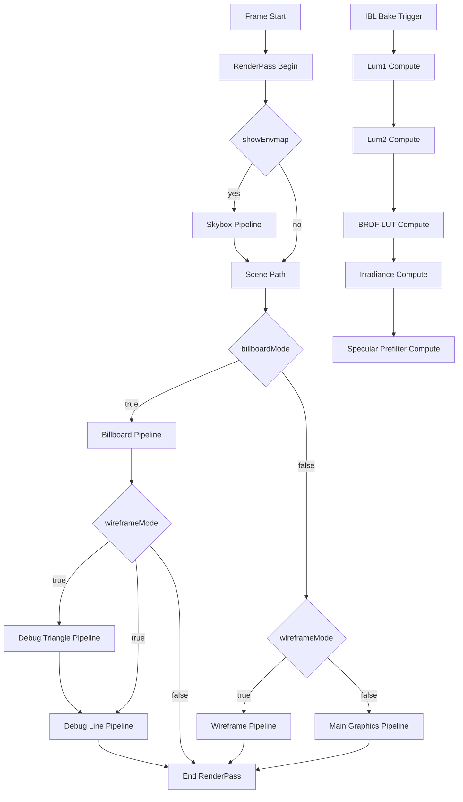

# Reference Pipelines Vulkan

Cette page centralise tous les pipelines de l'application (graphics + compute), leur configuration, et leur usage runtime.

## Vue Globale



## Graphics Pipelines

### 1) Main_Graphics_Pipeline

```text
DEBUG MAIN GRAPHICS PIPELINE
|- Shaders: shaders/vert.spv + shaders/frag.spv
|- Topology: TRIANGLE_LIST
|- Vertex Input:
|  |- binding 0: Vertex (position, color)
|  `- binding 1: instance vec3 offset
|- Raster:
|  |- polygon mode: FILL
|  |- cull: BACK
|  `- front face: CLOCKWISE
|- Depth:
|  |- test: ON (LESS)
|  `- write: ON
|- Blending: OFF
`- Runtime usage: icospheres instanciees (mode classique)
```

### 2) Skybox_Graphics_Pipeline

```text
DEBUG SKYBOX PIPELINE
|- Shaders: shaders/skybox_vert.spv + shaders/skybox_frag.spv
|- Topology: TRIANGLE_LIST
|- Vertex Input: none (fullscreen triangle)
|- Raster:
|  |- polygon mode: FILL
|  `- cull: NONE
|- Depth:
|  |- test: ON (LESS_OR_EQUAL)
|  `- write: OFF
|- Blending: OFF
`- Runtime usage: draw 3 vertices quand showEnvmap=true
```

### 3) Billboard_Graphics_Pipeline

```text
DEBUG BILLBOARD PIPELINE
|- Shaders: shaders/billboard_vert.spv + shaders/billboard_frag.spv
|- Topology: TRIANGLE_LIST
|- Vertex Input:
|  `- binding 1: BillboardInstance(pos, materialIdx)
|- Raster:
|  |- polygon mode: FILL
|  `- cull: NONE
|- Depth:
|  |- test: ON (LESS)
|  `- write: ON (avec gl_FragDepth corrige sur la sphere)
|- Blending: ON (SRC_ALPHA / ONE_MINUS_SRC_ALPHA)
`- Runtime usage: spheres raytracees en billboard mode
```

### 4) Wireframe_Graphics_Pipeline

```text
DEBUG WIREFRAME PIPELINE
|- Shaders: shaders/vert.spv + shaders/frag.spv
|- Topology: TRIANGLE_LIST
|- Vertex Input:
|  |- binding 0: Vertex
|  `- binding 1: instance vec3 offset
|- Raster:
|  |- polygon mode: LINE
|  `- cull: BACK
|- Depth:
|  |- test: ON (LESS)
|  `- write: ON
|- Blending: OFF
`- Runtime usage: icospheres mesh wireframe (non billboard)
```

### 5) Debug_Line_Pipeline

```text
DEBUG BILLBOARD OVERLAY - LINE
|- Shaders: shaders/debug_vert.spv + shaders/debug_frag.spv
|- Topology: LINE_LIST
|- Vertex Input:
|  `- binding 1: BillboardInstance(pos, materialIdx)
|- Raster:
|  |- polygon mode: LINE
|  `- cull: BACK (etat commun)
|- Depth:
|  |- test: ON (LESS)
|  `- write: OFF
|- Blending: OFF
`- Runtime usage:
   |- quad outlines verts (8 vertices/instance)
   `- boites pointillees jaunes (24 vertices/instance)
```

### 6) Debug_Triangle_Pipeline

```text
DEBUG BILLBOARD OVERLAY - TRIANGLE
|- Shaders: shaders/debug_vert.spv + shaders/debug_frag.spv
|- Topology: TRIANGLE_LIST
|- Vertex Input:
|  `- binding 1: BillboardInstance(pos, materialIdx)
|- Raster:
|  |- polygon mode: FILL
|  `- cull: BACK (etat commun)
|- Depth:
|  |- test: ON (LESS)
|  `- write: OFF
|- Blending: ON (SRC_ALPHA / ONE_MINUS_SRC_ALPHA)
`- Runtime usage: fill transparent du quad screen-space (6 vertices/instance)
```

## Focus: Vue Debug Spheres (Billboard + Wireframe)

Condition d'activation runtime:

- `billboardMode == true`
- `wireframeMode == true`

Ordre des draws:

1. `Debug_Triangle_Pipeline` (fill transparent)
1. `Debug_Line_Pipeline` (outline vert du quad)
1. `Debug_Line_Pipeline` (boite 3D pointillee jaune)

Push constants debug (`DebugPushConstant`):

- `model`
- `color`
- `radius`
- `mode` (`0 = box`, `1 = billboard`)
- `stippled` (`0 = normal`, `1 = stippled`, `2 = fill`)

Le pipeline debug lit le `materialIdx` de l'instance billboard (via `location=3`) pour garder une couleur materiau stable.

## Compute Pipelines IBL

### 7) IBL_Lum1

```text
COMPUTE PIPELINE IBL_Lum1
|- Shader: shaders/ibl_lum_pass1.spv
|- Descriptor set layout: lum1DescriptorSetLayout
|  |- binding 0: combined image sampler (env HDR)
|  `- binding 1: storage buffer (group sums)
|- Push constants: none
`- Dispatch: ((envW+15)/16, (envH+15)/16, 1)
```

### 8) IBL_Lum2

```text
COMPUTE PIPELINE IBL_Lum2
|- Shader: shaders/ibl_lum_pass2.spv
|- Descriptor set layout: lum2DescriptorSetLayout
|  |- binding 0: storage buffer (group sums)
|  `- binding 1: storage buffer (mean)
|- Push constants: {g, p}
`- Dispatch: (1, 1, 1)
```

### 9) IBL_Brdf

```text
COMPUTE PIPELINE IBL_Brdf
|- Shader: shaders/ibl_spbrdf.spv
|- Descriptor set layout: iblDescriptorSetLayout
|  |- binding 0: combined image sampler (env HDR)
|  `- binding 1: storage image (BRDF LUT)
|- Push constants: bloc 64 bytes (layout commun IBL)
`- Dispatch: (IBL_BRDF_SIZE/32, IBL_BRDF_SIZE/32, 1)
```

### 10) IBL_Irr

```text
COMPUTE PIPELINE IBL_Irr
|- Shader: shaders/ibl_irmap.spv
|- Descriptor set layout: iblDescriptorSetLayout
|  |- binding 0: combined image sampler (env HDR)
|  `- binding 1: storage image (irradiance)
|- Push constants: {threshold, offsetY, maxY}
`- Dispatch: (IBL_IRM_SIZE/32, IBL_IRM_SIZE/32, 1)
```

### 11) IBL_Spec

```text
COMPUTE PIPELINE IBL_Spec
|- Shader: shaders/ibl_spmap.spv
|- Descriptor set layout: iblDescriptorSetLayout
|  |- binding 0: combined image sampler (env HDR)
|  `- binding 1: storage image (prefilter mip view)
|- Push constants: {roughness, mip, threshold, offsetY, maxY}
`- Dispatch par mip: ((size+31)/32, (size+31)/32, 1)
```

## Fichiers Sources Reels

- Creation graphics pipelines: [src/vk_engine_init.cpp](src/vk_engine_init.cpp)
- Utilisation runtime graphics: [src/vk_engine_frame.cpp](src/vk_engine_frame.cpp)
- Creation et dispatch compute IBL: [src/vk_engine_ibl.cpp](src/vk_engine_ibl.cpp)
- Handles pipelines: [src/vk_engine.h](src/vk_engine.h)
