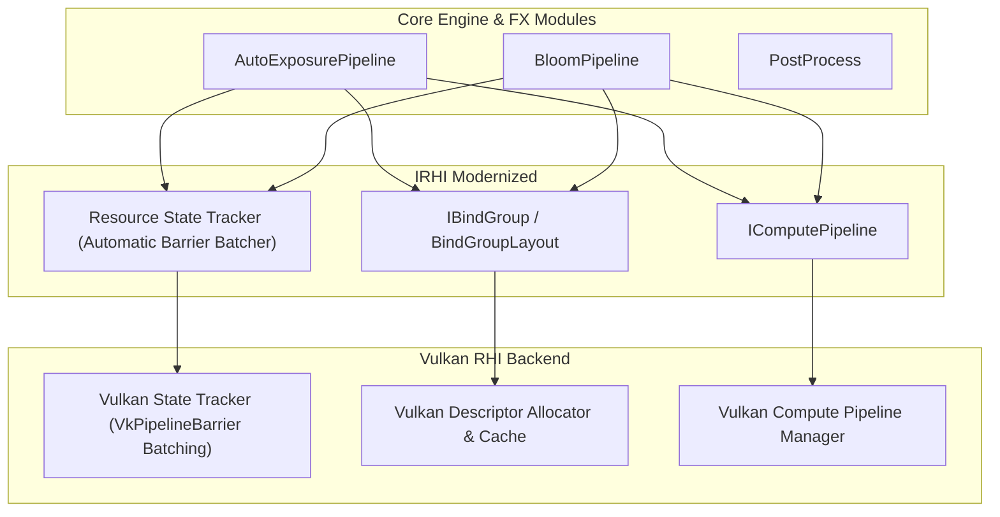

# Plan d'Évolution RHI : Resource State Tracking & Abstraction Compute Bindings

- **Date** : 17 Août 2026
- **Auteur** : Antigravity
- **Projet** : `suckless-vulkan`
- **Branche cible** : `feature/rhi-resource-state-tracking` (ou refactor post-merge)
- **Statut** : 📋 **Spécification & Plan d'Implémentation Détaillé**

______________________________________________________________________

## 1. Contexte & Rationale

L'intégration de l'Auto-Exposition (comme précédemment celle du Bloom Dual-Filtering) a mis en évidence deux axes majeurs de progression pour notre Render Hardware Interface (`IRHI`) :

1. **Élimination des barrières mémoire manuelles (`VkImageMemoryBarrier`)** : Actuellement, chaque effet compute gère ses propres transitions de layout. Cela introduit des risques de bugs critiques (ex: `VK_IMAGE_LAYOUT_UNDEFINED` écrasant l'historique temporel inter-frame).
1. **Abstraction native des Compute Pipelines & BindGroups** : `AutoExposurePipeline` et `BloomPipeline` manipulent directement des `VkDescriptorSetLayout` et `VkPipelineLayout`. Une abstraction moderne type WebGPU / D3D12 `IBindGroup` / `IComputePipeline` permettra de nettoyer et d'unifier ces modules.

______________________________________________________________________

## 2. Architecture Cible & Nouvelles Interfaces RHI



### 2.1 Énumération des États de Ressources (`ResourceState`)

```cpp
enum class ResourceState : uint32_t {
    Undefined = 0,
    Common = 1 << 0,
    VertexBuffer = 1 << 1,
    IndexBuffer = 1 << 2,
    UniformBuffer = 1 << 3,
    ShaderResource = 1 << 4,      // Lecture Fragment Shader (VK_IMAGE_LAYOUT_SHADER_READ_ONLY_OPTIMAL)
    ComputeShaderRead = 1 << 5,   // Lecture Compute Shader Sampler (VK_IMAGE_LAYOUT_SHADER_READ_ONLY_OPTIMAL)
    ComputeShaderWrite = 1 << 6,  // Écriture Storage Image / SSBO (VK_IMAGE_LAYOUT_GENERAL)
    ComputeShaderReadWrite = (1 << 5) | (1 << 6),
    RenderTarget = 1 << 7,        // Color Attachment (VK_IMAGE_LAYOUT_COLOR_ATTACHMENT_OPTIMAL)
    DepthStencil = 1 << 8,        // Depth Attachment
    TransferSrc = 1 << 9,
    TransferDst = 1 << 10,
    Present = 1 << 11
};
```

### 2.2 Extension de l'Interface `IRHI`

```cpp
class IRHI {
public:
    // ... existant ...

    // 1. Resource State Tracking
    virtual void TransitionTexture(ICommandList* cmd, TextureHandle texture, ResourceState newState) = 0;
    virtual void TransitionBuffer(ICommandList* cmd, BufferHandle buffer, ResourceState newState) = 0;
    virtual void FlushBarriers(ICommandList* cmd) = 0; // Batching automatique de multiples barrières

    // 2. Compute Pipeline & BindGroups
    virtual ComputePipelineHandle CreateComputePipeline(const ComputePipelineDesc& desc) = 0;
    virtual BindGroupHandle CreateBindGroup(const BindGroupDesc& desc) = 0;
    virtual void BindComputePipeline(ICommandList* cmd, ComputePipelineHandle pipeline) = 0;
    virtual void BindGroup(ICommandList* cmd, uint32_t setIndex, BindGroupHandle bindGroup) = 0;
    virtual void DispatchCompute(ICommandList* cmd, uint32_t groupX, uint32_t groupY, uint32_t groupZ) = 0;
};
```

______________________________________________________________________

## 3. Plan d'Implémentation par Phases (SoC & TDD)

### 🔹 Phase 1 : Resource State Tracker (Sécurité des Mémoires GPU)

- [ ] Ajouter `ResourceState currentState` dans les métadonnées de `ITexture` et `IBuffer`.
- [ ] Implémenter la translation `ResourceState` $\\to$ (`VkImageLayout`, `VkAccessFlags`, `VkPipelineStageFlags`).
- [ ] Implémenter le batching des barrières dans `VulkanCommandList` pour regrouper plusieurs transitions en un seul appel `vkCmdPipelineBarrier`.
- [ ] **Test Unitaire** : Vérifier que `TransitionTexture(tex, ShaderResource)` conserve l'état et ne produit aucun `VK_IMAGE_LAYOUT_UNDEFINED` destructeur.

### 🔹 Phase 2 : Abstraction BindGroups & Compute Pipelines

- [ ] Définir `BindGroupDesc` (bindings de Samplers, Textures, StorageImages, SSBOs).
- [ ] Définir `ComputePipelineDesc` (SPIR-V shader, push constant ranges, bind group layouts).
- [ ] Implémenter le backend Vulkan avec mise en cache (`VulkanDescriptorCache` et `VulkanComputePipeline`).

### 🔹 Phase 3 : Refactorisation de l'Auto-Exposition (`AutoExposurePipeline`)

- [ ] Remplacer les appels directs Vulkan dans \[`src/vk_engine_autoexposure.cpp`\](../src/vk_engine_autoexposure.cpp) par les appels RHI unifiés :
  - `rhi->TransitionTexture(cmd, exposureTex, ResourceState::ComputeShaderReadWrite);`
  - `rhi->BindComputePipeline(cmd, histogramPipeline);`
  - `rhi->DispatchCompute(cmd, width / 16, height / 16, 1);`
- [ ] Réduire le code de `vk_engine_autoexposure.cpp` de 320 lignes à moins de 120 lignes de pure logique de passe.

### 🔹 Phase 4 : Refactorisation du Bloom (`BloomPipeline`)

- [ ] Porter `BloomPipeline` sur les nouvelles primitives RHI (suppression du boilerplate descriptor pool par passe).
- [ ] Validation complète sous tests d'intégration et profiling Tracy.

______________________________________________________________________

## 4. Bénéfices Attendus

| Métrique / Aspect | Avant Refactor | Après Évolution RHI |
| :--- | :--- | :--- |
| **Boilerplate par Passe Compute** | ~150 lignes Vulkan brutes | ~15 lignes d'appels RHI déclaratifs |
| **Risque de Layout Discard** | Élevé (gestion manuelle `UNDEFINED`) | Nul (State Tracker automatique) |
| **Batching des Barrières** | 1 `vkCmdPipelineBarrier` par texture | 1 seul `vkCmdPipelineBarrier` groupé par passe |
| **Indépendance de l'API** | Dépendance Vulkan directe dans chaque effet | 100% agnostique via `IRHI` (prêt pour Metal / D3D12) |
