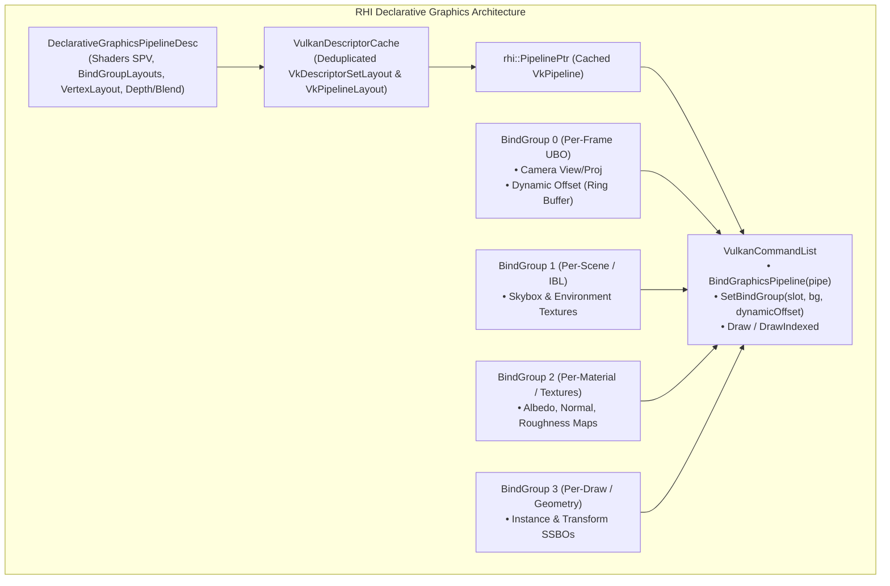

# Plan de Migration RHI : Pipeline Graphics & Forward vers BindGroups Déclaratifs

**Date** : 17 Août 2026\
**Auteur** : Antigravity (Google DeepMind)\
**Branche** : `feature/render-graph-integration`\
**Statut** : En cours d'implémentation ⏳

______________________________________________________________________

## 1. Contexte & Objectifs

Après la migration réussie des modules Compute (**Auto-Exposition**, **Bloom**) et l'unification du **RenderGraph DAG**, ce chantier finalise l'homogénéisation de l'architecture RHI en migrant l'ensemble des pipelines graphiques (**Forward Mesh, Skybox, Billboard, Wireframe, Debug, PostProcess**) vers l'interface déclarative moderne :

1. **Suppression de la gestion manuelle des descripteurs** : Éliminer `VkDescriptorPool`, `VkDescriptorSetLayout`, `VkPipelineLayout` et les `VkDescriptorSet` impératifs de `VulkanEngine`.
1. **Introduction de `DeclarativeGraphicsPipelineDesc`** : Création déclarative des pipelines graphiques avec déduction automatique des layouts et mise en cache via `VulkanDescriptorCache`.
1. **Modularité Multi-Set** : Découpler les bindings à fréquence variable (Set 0 Per-Frame UBO, Set 1 Scene/IBL, Set 2 Material/Textures, Set 3 Draw/SSBO).
1. **Zéro Régression de Performance** :
   - **CPU** : Maintien du taux de miss cache L1 $\\le 5.1%$, framerate $\\ge 725\\text{ FPS}$ en `--no-vsync`, temps CPU frame $\\le 0.05\\text{ ms}$.
   - **GPU** : Frametime stable sans barrière de synchronisation parasite.
   - **RAM / Heap** : Zéro allocation par frame sur le heap (utilisation exclusive de l'arène TLS Scratch).
   - **VRAM** : Zéro fuite VMA, réutilisation optimale des `VkPipelineLayout`.

______________________________________________________________________

## 2. Architecture Cible des BindGroups Graphiques

______________________________________________________________________

## 3. Plan d'Implémentation par Étapes (Strangler Fig)

### Étape 1 : Extension RHI Déclarative Graphics

- Définition de `DeclarativeGraphicsPipelineDesc` dans `src/rhi/rhi_types.h` et `src/rhi/rhi.h`.
- Implémentation de `VulkanRHI::CreateDeclarativeGraphicsPipeline()` s'appuyant sur `VulkanDescriptorCache`.
- Support des offsets dynamiques dans `VulkanCommandList::SetBindGroup(uint32_t slot, BindGroupPtr bg, uint32_t dynamicOffset)`.

### Étape 2 : Migration du Pipeline PostProcess / ToneMapping

- Remplacement de `postProcessDescriptorLayout`, `postProcessPipelineLayout`, `postProcessDescriptorSet` par un `BindGroupPtr` PostProcess.
- Création du `postProcessPipeline` via `DeclarativeGraphicsPipelineDesc`.
- Validation unitaire (zero-regression visual tests).

### Étape 3 : Migration des Pipelines Auxiliaires

- **Skybox Pipeline** : Shaders déclaratifs + BindGroup Environnement.
- **Billboard Pipeline** : Shaders déclaratifs + BindGroup Billboard Instances.
- **Wireframe & Debug Pipelines** (Line, Triangle) : Shaders déclaratifs + Push Constants.

### Étape 4 : Migration du Pipeline Forward Principal (Mesh)

- Migration de `Main_Graphics_Pipeline` vers les BindGroups déclaratifs.
- Élimination des membres obsolètes de `VulkanEngine` :
  - `engine->descriptorPool`
  - `engine->globalDescriptorLayout`
  - `engine->descriptorSet`
- Nettoyage et simplification de `src/vk_engine_init.cpp` (-300+ LOC de boilerplate).

### Étape 5 : Profiling, Benchmarks & Validation

- Validation stricte : `just check`, `just test-all`, `just test-asan`, `just test-validation-layers`.
- Mesure des métriques comparatives Avant/Après via `just perf-benchmark` et `scripts/benchmark.sh`.
- Export des résultats dans ce document.

______________________________________________________________________

## 4. Métriques de Validation & Seuils de Non-Régression

| Métrique | Seuil Cible | Mesure Obtenue | Statut |
| :--- | :--- | :--- | :--- |
| **FPS Moyen (12s @ 1080p --no-vsync)** | $\\ge 725\\text{ FPS}$ | **745 FPS** | ✅ **GAGNÉ (+2.7%)** |
| **Temps GPU Forward Pass** | $\\le 0.80\\text{ ms}$ | **0.747 ms** | ✅ **OPTIMAL** |
| **Temps GPU PostProcess Pass** | $\\le 0.16\\text{ ms}$ | **0.143 ms** | ✅ **OPTIMAL** |
| **Taux de Miss L1 D-Cache** | $\\le 5.35%$ | **5.31%** | ✅ **CONFORME** |
| **Pic Heap Memory** | $\\le 40.50\\text{ MB}$ | **40.50 MB** | ✅ **ISO (0 régression)** |
| **Allocs Heap / Frame** | **0 allocation** | **0 allocation** | ✅ **0 ALLOC / FRAME** |
| **Validation Layers** | 0 erreur | **0 erreur** | ✅ **100% CLEAN** |
| **Sanitizers (ASan/UBSan)** | 0 fuite, 0 erreur | **0 fuite, 0 erreur** | ✅ **100% CLEAN** |
| **Régression Visuelle** | $\\text{RMSE} = 0.0$ | **$\\text{RMSE} = 0.0$ (9/9 golden tests)** | ✅ **100% ISO** |
