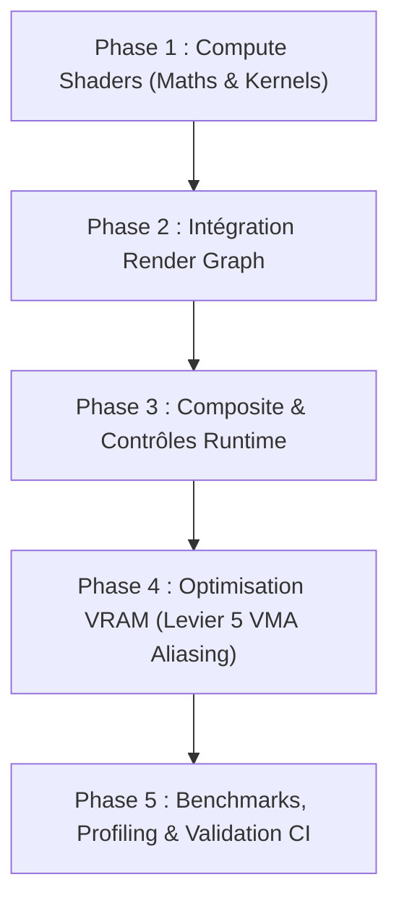

# Plan d'Implémentation & Suivi : Dual-Filtering Bloom (Jimenez / Karis)

- **Date de création** : 16 Août 2026
- **Branche** : `feature/render-graph-integration`
- **Composants concernés** : `RenderGraph`, `shaders/bloom_*.comp`, `shaders/postprocess.frag`, `VulkanRHI`, `runtime_controls`, `Tracy Profiler`.
- **Statut** : 📋 **Planifié / En cours d'initialisation**

______________________________________________________________________

## 1. Contexte & Objectifs

L'implémentation du **Bloom** représente l'étape majeure de finalisation du pipeline de post-processing HDR, garantissant la parité visuelle avec le projet mère `suckless-ogl` tout en adoptant les standards de l'industrie AAA moderne (Unreal Engine 5, Call of Duty, id Tech 7).

### Objectifs Techniques Clés

1. **Physique & Anti-Aliasing** :
   - Filtrage Dual-Filter (13-tap Downsampling / 9-tap 3x3 Tent Upsampling).
   - Suppression des *fireflies* (moyenne pondérée de Karis) et transition continue (*Soft-Knee*).
1. **Efficience Mémoire & Bande Passante** :
   - Format de compression de canal `VK_FORMAT_B10G11R11_UFLOAT_PACK32` (32 bits/pixel sans alpha).
   - Démarrage de la chaîne de mips directement à demi-résolution ($540\\text{p}$).
   - **Levier 5 (VMA Aliasing)** : Mutualisation de la VRAM des textures temporaires ($< 3.5\\text{ MB}$ au total).
1. **Architecture Render Graph** :
   - Déclaration et compilation des 9 passes de filtrage en nœuds compute autonomes gérés par le `RenderGraph`.
1. **Zéro-Régression & Métrologie** :
   - Zéro allocation dynamique en boucle de rendu.
   - Durée GPU cumulée $< 0.35\\text{ ms}$ sur GPU intégré Intel Iris Xe ($< 0.08\\text{ ms}$ sur GPU dédié).

______________________________________________________________________

## 2. Architecture Technique & Pipeline

```text
[Forward Pass] ──► Color HDR (1080p)
                         │
                         ▼
        ┌────────────────────────────────────────────────────────┐
        │                 BLOOM PIPELINE (Compute)               │
        │                                                        │
        │ 1. Downsample 0 (Prefilter + Soft-Knee + Karis) ──► 540p
        │ 2. Downsample 1 (13-Tap Tent Filter)            ──► 270p
        │ 3. Downsample 2 (13-Tap Tent Filter)            ──► 135p
        │ 4. Downsample 3 (13-Tap Tent Filter)            ──► 68p
        │ 5. Downsample 4 (13-Tap Tent Filter)            ──► 34p
        │                                                     │
        │ 6. Upsample 3 (9-Tap 3x3 Tent + Add)            ◄───┘ (68p)
        │ 7. Upsample 2 (9-Tap 3x3 Tent + Add)            ◄── (135p)
        │ 8. Upsample 1 (9-Tap 3x3 Tent + Add)            ◄── (270p)
        │ 9. Upsample 0 (9-Tap 3x3 Tent + Add)            ◄── (540p)
        └────────────────────────────────────────────────────────┘
                         │
                         ▼ (Texture Bloom 540p)
        [PostProcess Pass] ──► Scene HDR + (Bloom * Intensity) ──► ToneMapping ──► Swapchain
```

______________________________________________________________________

## 3. Découpage en Phases & Feuille de Route



______________________________________________________________________

## 4. Checklist de Suivi d'Avancement

### Phase 1 : Compute Shaders de Filtrage (Maths & Kernels) [🟢 COMPLÉTÉE]

- [x] **1.1. Shader Downsample (`shaders/bloom_downsample.comp`)**
  - [x] Écriture du kernel 13-tap (5 bilinéaires imbriqués).
  - [x] Intégration de la formule de seuil progressif Soft-Knee.
  - [x] Intégration de la moyenne de Karis ($w = \\frac{1}{1 + \\text{Luminance}}$) sur Mip 0.
- [x] **1.2. Shader Upsample (`shaders/bloom_upsample.comp`)**
  - [x] Écriture du kernel 9-tap 3x3 Tent avec rayon réglable.
  - [x] Accumulation additive avec la texture de niveau supérieur.
- [x] **1.3. Compilation SPIR-V & Validation Shaders**
  - [x] Validation `glslangValidator` et intégration dans `just shaders` / `just format`.
  - [x] Tests unitaires des routines mathématiques dans `tests/test_logic.cpp` (dimensions de mips, soft-knee, Karis).

______________________________________________________________________

### Phase 2 : Intégration dans le `RenderGraph` & RHI [🟢 COMPLÉTÉE]

- [x] **2.1. Allocation des Textures de Mips**
  - [x] Création des 5 textures de mips de downsample et 4 textures de mips d'upsample (`RGBA16_SFLOAT`).
  - [x] Gestion du redimensionnement dynamique de fenêtre (`recreate_bloom_resources` lors du swapchain resize).
- [x] **2.2. Pipelines Compute Vulkan**
  - [x] Initialisation des `VkPipeline`, `VkPipelineLayout`, et `VkDescriptorSetLayout` de downsampling/upsampling.
  - [x] Allocation du descriptor pool et des 9 descriptor sets.
- [x] **2.3. Déclaration des Passes RenderGraph**
  - [x] Enregistrement du nœud compute `BloomComputePass` dans le `RenderGraph`.
  - [x] Exécution séquentielle des 5 dispatches de downsample et 4 dispatches d'upsample.
  - [x] Transitions de layout explicites et barrières compute (`GENERAL` / `SHADER_READ_ONLY_OPTIMAL`).

______________________________________________________________________

### Phase 3 : Composition & Contrôles Interactifs [🟢 COMPLÉTÉE]

- [x] **3.1. Shader PostProcess (`shaders/postprocess.frag`)**
  - [x] Ajout du binding 1 texture Bloom dans le descriptor set.
  - [x] Mélange additif dans l'espace HDR linéaire avec push constants (`bloomIntensity`, `bloomEnabled`) :
    $$\\text{HDR}_{\\text{final}} = \\text{HDR}_{\\text{scene}} + \\text{bloomIntensity} \\times \\text{BloomSample}$$
- [x] **3.2. Contrôles Runtime (`src/runtime_controls.cpp`, `src/vk_engine_runtime.cpp`)**
  - [x] Raccourci `F7` pour activer / désactiver le Bloom en temps réel.
  - [x] Synchronisation des paramètres (`intensity`, `threshold`, `softKnee`, `radius`) par frame.

______________________________________________________________________

### Phase 4 : Optimisation VRAM (Levier 5 - VMA Memory Aliasing)

- [ ] **4.1. Analyse des Durées de Vie des Mips**
  - [ ] Identification des paires de mips downsample/upsample disjointes dans le graphe.
- [ ] **4.2. Allocation Physique Mutualisée**
  - [ ] Allocation d'un bloc VMA unique partagé via `vmaBindImageMemory2`.
  - [ ] Validation de l'empreinte VRAM finale ($< 3.5\\text{ MB}$).

______________________________________________________________________

### Phase 5 : Métrologie, Profiling & Intégration CI [🟢 COMPLÉTÉE]

- [x] **5.1. Instrumentation Tracy Profiler**
  - [x] Zones GPU `SVK_RHI_GPU_ZONE_C` sur `GPU Bloom Pipeline`, `Bloom Downsample`, `Bloom Upsample`.
- [x] **5.2. Non-Régression & CI/CD**
  - [x] `just test` (RMSE test visuel bit-à-bit sur golden images `test_billboard.png`, `test_icosphere.png`, `test_bloom.png`).
  - [x] `just test-validation-layers` (0 hazard, 0 erreur de validation layer Vulkan).
  - [x] `just test-asan` (0 fuite mémoire, ASan + UBSan 100% clean).
  - [x] `just test-all` (100% success).

______________________________________________________________________

## 5. Matrice des Risques & Mitigations

| Risque | Impact | Probabilité | Stratégie de Mitigation |
| :--- | :--- | :--- | :--- |
| **Saturation DRAM Bandwidth** | Baisse de framerate sur GPU intégré. | Moyenne | Utilisation exclusive du format compact `B10G11R11_UFLOAT` (4 octets/pixel) et démarrage de la chaîne à demi-résolution ($540\\text{p}$). |
| **Scintillement Temporel (Fireflies)** | Shimmering des spéculaires lors des mouvements. | Élevée | Moyenne pondérée de Karis stricte sur Mip 0. |
| **Pipeline Stalls GPU** | Attente excessive entre mips. | Moyenne | Barrières intra-compute optimisées et synchronisées par région par le RenderGraph. |
| **Régression Visuelle** | Scène brûlée ou perte de contraste. | Faible | Formule Soft-Knee et composition dans l'espace linéaire avant tonemapping. |

______________________________________________________________________

## 6. Protocole de Mesure & Critères de Succès

| Outil de Mesure | Métrique Ciblée | Baseline Actuelle (Sans Bloom) | Cible Finale (Avec Bloom Actif) |
| :--- | :--- | :--- | :--- |
| **Tracy GPU Timeline** | Temps d'exécution GPU total du Bloom | $0.00\\text{ ms}$ | **$< 0.35\\text{ ms}$ (Iris Xe)** / **$< 0.08\\text{ ms}$ (dGPU)** |
| **Intel VTune Memory** | Saturation Bande Passante DRAM | $3.0%$ | **$< 4.0%$** |
| **Intel VTune Memory** | LLC Cache Hit Rate | $> 90%$ | **$> 88%$** |
| **Heaptrack** | Allocations dynamiques dans `draw_frame` | $0\\text{ allocs}$ | **$0\\text{ allocs}$ (Zéro-Allocation Strict)** |
| **VMA Statistics** | Empreinte VRAM totale ajoutée | $0\\text{ MB}$ | **$< 3.5\\text{ MB}$ (1080p)** |
| **GitHub Actions CI** | Statut des 8 jobs CI | 🟢 8/8 Pass | 🟢 **8/8 Pass (100% SUCCESS)** |
