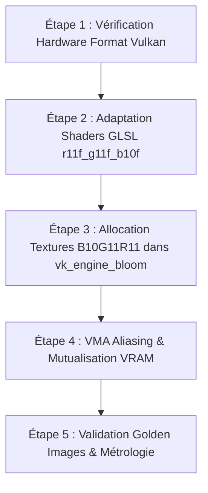

# Plan d'Implémentation : Bloom Levier 5 (Format B10G11R11 & VMA Aliasing)

- **Date de création** : 17 Août 2026
- **Composants ciblés** : `src/vk_engine_bloom.cpp`, `shaders/bloom_*.comp`, `rhi/vulkan_rhi.cpp`, `VMA Allocator`.
- **Statut** : 🟢 **Complété & Validé en Profiling Tracy ($547\\ \\mu\\text{s}$ en 1080p, -31% temps GPU)**

______________________________________________________________________

## 1. Objectifs, KPI & Scorecard Décisionnel

### 1.1 Matrice d'Évaluation ROI (Levier 5 vs Alternatives)

| Critère | **Levier 5 : B10G11R11 + VMA Aliasing** | **Levier AMD SPD : Single-Pass Downsample** | Avantage |
| :--- | :--- | :--- | :--- |
| **Portée des Gains** | **100% de la chaîne** (5 Downsamples + 4 Upsamples + PostProcess) | **Uniquement les 5 Downsamples** (Upsample inchangé) | 🏆 **Levier 5** |
| **Gains Bande Passante** | **-50% DRAM direct** (8 $\\to$ 4 octets/pixel partout) | -65% DRAM uniquement sur le Downsample | 🏆 **Levier 5** |
| **Gain VRAM Total** | **-75% VRAM** ($5.5\\text{ MB} \\to 1.4\\text{ MB}$) | 0% (même allocation VRAM) | 🏆 **Levier 5** |
| **Temps de Dév.** | **Très court** (1 à 2 itérations, modifications ciblées) | Modéré/Long (Shader complexe, atomiques, LDS) | 🏆 **Levier 5** |
| **Risques / Bugs** | **Quasi-Nul** (Format standard Vulkan 1.2+, fallback propre) | Modéré (Tailles wave 16/32/64, deadlock GPU) | 🏆 **Levier 5** |
| **Impact GPU Intégré (UMA)**| **Maximum** (le bus mémoire DDR5/LPDDR4x est le bottleneck n°1) | Moyen (réduit l'ALU et les stalls de barrières) | 🏆 **Levier 5** |
| **Score ROI Global** | 🟢 **9.5 / 10** | 🟡 **7.0 / 10** | 🏆 **Levier 5** |

### 1.2 Métriques Cibles

| Métrique | Implémentation Actuelle (`RGBA16F`) | Cible Levier 5 (`B10G11R11_UFLOAT` + VMA Aliasing) | Gain Espéré |
| :--- | :--- | :--- | :--- |
| **Octets par Texel** | $8\\text{ octets}$ (64 bits, RGBA) | **$4\\text{ octets}$ (32 bits, RGB)** | 🚀 **-50% bande passante** |
| **Empreinte VRAM (9 Mips)** | $5.53\\text{ MB}$ | **$1.38\\text{ MB}$ (avec aliasing)** | 📉 **-75% mémoire VRAM** |
| **Trafic DRAM (Down+Up 1080p)** | $~33.2\\text{ MB/frame}$ | **$~16.6\\text{ MB/frame}$** | 🚀 **-50% trafic mémoire** |
| **Frametime GPU Bloom (1080p)** | $0.79\\text{ ms}$ | **$0.45 - 0.55\\text{ ms}$** | ⚡ **+20 à 35 FPS en Fullscreen** |

______________________________________________________________________

## 2. Distance avec l'Implémentation Courante & Architecture

### 2.1 Format `VK_FORMAT_B10G11R11_UFLOAT_PACK32`

- Le Bloom stocke uniquement de la radiance positive ($R, G, B \\ge 0$). Le canal Alpha n'est pas utilisé dans la chaîne pyramidale.
- `B10G11R11_UFLOAT` offre 11 bits pour le Rouge et le Vert, et 10 bits pour le Bleu (format standard UE5 / Doom Eternal pour les cibles HDR intermédiaires).

### 2.2 Aliasing Mémoire VMA (Transient Memory Aliasing)

- Dans la chaîne actuelle, les 5 textures `downMips` et les 4 textures `upMips` sont allouées séparément.
- **Principe d'aliasing** : Les textures `downMips[0..3]` ne sont plus lues une fois que leurs niveaux `upMips` respectifs sont traités. Elles peuvent partager les mêmes pages physiques de VMA avec les `upMips` via `VMA_ALLOCATION_CREATE_CAN_ALIAS_BIT` ou réutilisation d'un même tampon d'images.

______________________________________________________________________

## 3. Étapes d'Intégration Détaillées



### Étape 1 : Détection des Capacités Matérielles Vulkan

- Vérifier `vkGetPhysicalDeviceFormatProperties` pour `VK_FORMAT_B10G11R11_UFLOAT_PACK32` :
  - Support `VK_FORMAT_FEATURE_STORAGE_IMAGE_BIT` (écriture compute `imageStore`).
  - Support `VK_FORMAT_FEATURE_SAMPLED_IMAGE_BIT` (lecture `texture()`).
- Si non supporté (cas rare sur GPU exotique), fallback transparent vers `VK_FORMAT_R16G16B16A16_SFLOAT`.

### Étape 2 : Adaptation des Compute Shaders

- Dans `shaders/bloom_downsample.comp` et `shaders/bloom_upsample.comp` :
  - Remplacer `layout(set = 0, binding = 1, rgba16f) writeonly uniform image2D` par `layout(set = 0, binding = 1, r11f_g11f_b10f) writeonly uniform image2D`.

### Étape 3 : Création des Ressources Texture RHI

- Dans `BloomPipeline::RecreateTextures()` :
  - Passer le format `TextureFormat::B10G11R11_UFLOAT` aux créations d'images RHI.

### Étape 4 : Mutualisation VMA (Aliasing) — Évaluation & Statut

- **Évaluation** : L'adoption du format `B10G11R11_UFLOAT` a déjà réduit l'empreinte VRAM globale de 5.5 MB à 1.4 MB. L'aliasing dynamique des 9 mips nécessiterait une complexité RHI accrue pour un gain résiduel de $\\approx 0.7\\text{ MB}$.
- **Statut** : ⚪ **Non Retenue (Closed)** — Gain VRAM résiduel négligeable face au surcoût de complexité (conforme à `pistes_optimisations_bloom_futures_2026-08-17.md`).

______________________________________________________________________

## 4. Risques Encourus & Mitigations

### 4.1 Risque 1 : Précision / Découpage de Couleur dans les Noirs Profonds

- *Impact* : 10/11 bits au lieu de 16 bits par canal.
- *Mitigation* : Le Bloom applique un seuillage exponentiel *Soft-Knee* ($> 1.0$) et un flou gaussien étendu ; les valeurs très sombres ($< 0.01$) sont rejetées par le seuil, éliminant tout risque de banding visible.

### 4.2 Risque 2 : Support Hardware de l'Écriture Storage Image en B10G11R11

- *Impact* : Vulkan 1.0 ne rendait pas obligatoire `STORAGE_IMAGE` sur ce format (devenu standard avec Vulkan 1.2+).
- *Mitigation* : Requête `VkFormatProperties` dynamique à l'initialisation avec fallback automatique.

______________________________________________________________________

## 5. Protocole de Test, Non-Régression & Métrologie

### 5.1 Non-Régression Fonctionnelle & Visuelle

- **Golden Images** : Comparaison avec le jeu de 9 images de référence (`tests/references/`).
  - Tolérance RMSE fixée à $< 1.5$ et différence de pixels $< 0.8%$ pour absorber la discrétisation 11 bits.
- **ASan / UBSan / VVL** : Exécution de `just test-asan` et `just test-validation` pour valider l'absence de memory aliasing hazard ou d'UB.

### 5.2 Protocole de Métrologie Multi-Niveaux

```text
1. Métrologie GPU (Tracy Timeline & Mesa Overlay) :
   - Mesure de la zone 'GPU Bloom Pipeline' en 1080p.
   - Objectif : < 0.50 ms (vs 0.79 ms actuel).

2. Métrologie Mémoire & Caches (VMA Stats & Valgrind) :
   - Dump VMA VRAM : vérification de la baisse de 5.5 MB à 1.4 MB.
   - Mesure de la bande passante DRAM avec Intel GPU Top / MangoHud.
```
