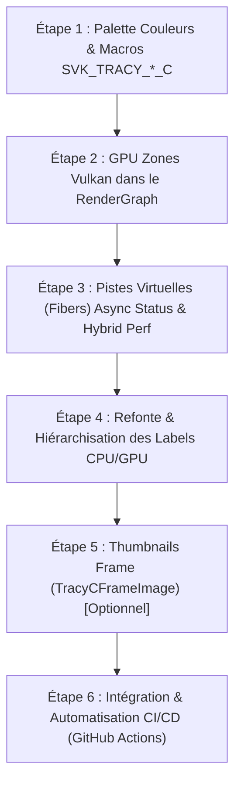

# Plan d'Amélioration & Parité Tracy Profiler : suckless-vulkan vs suckless-ogl (15 Août 2026)

## 1. Contexte & Objectifs

L'analyse comparative des traces de profiling entre le projet mère **`suckless-ogl`** (OpenGL) et **`suckless-vulkan`** (Vulkan) met en évidence un déficit de lisibilité et de richesse d'instrumentation dans la version Vulkan :

- **Absence de couleurs sémantiques** : Toutes les zones CPU partagent la couleur verte uniforme par défaut.
- **Piste GPU Vulkan incomplète** : Seuls 4 Compute Shaders IBL sont instrumentés ; les passes graphiques du RenderGraph (`ForwardPass`, `PostProcessPass`, `Skybox`, `Billboard`) sont absentes de la timeline GPU.
- **Absence de pistes virtuelles (Fibers)** : Les pistes macroscopiques **`Async Status`** (machine à états du loader d'assets) et **`Hybrid Perf`** (découpage CPU Host vs GPU Sync Wait pour le bake IBL) ne sont pas implémentées.
- **Nomenclature brute** : Noms de fonctions C internes au lieu de labels clairs et hiérarchisés.

Ce document définit la feuille de route d'implémentation par étapes pour atteindre la **parité fonctionnelle et visuelle totale**, accompagnée d'une **stratégie de validation programmatique automatisée** à chaque fin d'étape.

______________________________________________________________________

## 2. Tableau Comparatif & Diagnostic

| Axe de Profiling | `suckless-ogl` (Référence) | `suckless-vulkan` (Actuel) | Cible `suckless-vulkan` |
|---|---|---|---|
| **Palette Sémantique** | Couleurs dédiées par type de travail (CPU, GPU, I/O, Sync) | Couleur verte uniforme par défaut | Palette standardisée (Orange, Bleu, Violet, Vert, Cyan, Corail) |
| **GPU Timeline** | Toutes les passes de rendu visibles sur la timeline matérielle | Uniquement 4 Compute Shaders IBL ponctuels | 100% des passes graphiques RenderGraph instrumentées (`TracyVkZone`) |
| **Piste "Async Status"** | Piste Fiber dédiée affichant les états `IDLE`, `LOADING`, `CONVERT`, `READY` | Aucune | Piste Fiber dédiée avec synchronisation d'état thread-safe |
| **Piste "Hybrid Perf"** | Piste Fiber dédiée mesurant `Host (CPU)` vs `Sync (GPU Wait)` | Aucune | Piste Fiber mesurant le bake IBL et les synchronisations de queues |
| **Ergonomie Labels** | Hiérarchie claire (`Total Frame`, `App Update`, `Scene Pass`) | Noms techniques (`vk_draw_frame_internal`, `hdr_io_thread_decode`) | Libellés descriptifs et standardisés |

______________________________________________________________________

## 3. Plan d'Implémentation par Étapes & Validation Programmatique



______________________________________________________________________

### 3.1. Étape 1 : Palette de Couleurs Sémantiques & Macros RHI

#### A. Description des Changements (Étape 1)

- Étendre \[`src/tracy_client.h`\](file:///home/latty/Prog/__PERSO__/suckless-vulkan/src/tracy_client.h) pour introduire la macro `SVK_TRACY_ZONE_SCOPED_C(name, color)` mappée sur `ZoneScopedNC(name, color)`.
- Définir une palette de constantes hexadécimales standardisées :

```cpp
namespace tracy_color {
    // --- Main Frame Loop (Vert foncé parent, enfants par domaines) ---
    constexpr uint32_t FrameTotal     = 0x2E7D32; // Vert forêt foncé (Total Frame)
    constexpr uint32_t CpuAcquire     = 0xEF6C00; // Orange vif (Acquire Swapchain)
    constexpr uint32_t CpuUpdate      = 0x1976D2; // Bleu royal (Logique & Uniforms)
    constexpr uint32_t CpuUpdateChild = 0x42A5F5; // Bleu ciel (Enfant: Process Ready Texture)
    constexpr uint32_t CpuRecord      = 0x7B1FA2; // Violet pourpre (RenderGraph Record)
    constexpr uint32_t CpuPresent     = 0x00897B; // Sarcelle / Vert d'eau (Queue Submit & Present)

    // --- Async I/O Thread (Palette Chaude : Brun foncé parent -> Oranges -> Ors) ---
    constexpr uint32_t IoProcess      = 0x4E342E; // Brun espresso profond (Conteneur Parent Iteration)
    constexpr uint32_t IoDecode       = 0xE65100; // Orange brûlé vif (Enfant: Décodage STB / Disque)
    constexpr uint32_t IoAlloc        = 0xFF8F00; // Ambre doré (Enfant: Allocations VMA Texture)
    constexpr uint32_t IoStaging      = 0xF57C00; // Mandarine (Enfant: Setup Staging Host)
    constexpr uint32_t IoBakeAlloc    = 0xFFA726; // Jaune orangé clair (Sous-enfant: Bake Allocations)
    constexpr uint32_t IoCleanup      = 0x8D6E63; // Taupe / Brun ardoise (Nettoyage buffers)

    // --- Compute & Rendering ---
    constexpr uint32_t GpuCompute     = 0xF57F17; // Or solaire (Compute Shaders IBL)
    constexpr uint32_t GpuPass        = 0xD32F2F; // Rouge rubis (Passes graphiques)
    constexpr uint32_t SyncWait       = 0x607D8B; // Gris acier (Fences / Wait Idle)
    constexpr uint32_t InitShutdown   = 0x263238; // Bleu nuit anthracite (Init / Shutdown)
}
```

- Mettre à jour les zones CPU existantes dans \[`src/vk_engine_frame.cpp`\](file:///home/latty/Prog/__PERSO__/suckless-vulkan/src/vk_engine_frame.cpp) et \[`src/vk_engine_envmap.cpp`\](file:///home/latty/Prog/__PERSO__/suckless-vulkan/src/vk_engine_envmap.cpp).

#### B. Stratégie de Validation Programmatique (Étape 1)

- **Script de validation CLI** :

```bash
just benchmark-tracy
```

- **Assertion automatique** :
  - Exécuter un script Python d'assertion vérifiant dans `profiling/all_zones.csv` que les zones CPU sont bien présentes et que l'export Tracy ne génère aucune erreur d'encodage de couleur.
- **Contrôle CTest & Sanitizers** :

```bash
just test-all && just test-asan
```

______________________________________________________________________

### 3.2. Étape 2 : GPU Zones Vulkan dans le RenderGraph

#### A. Description des Changements (Étape 2)

- Dans \[`src/tracy_vulkan.h`\](file:///home/latty/Prog/__PERSO__/suckless-vulkan/src/tracy_vulkan.h), enrichir les macros GPU pour supporter les couleurs :

```cpp
#define SVK_TRACY_VK_ZONE_C(varname, engine, cb, name, color) \
    TracyVkNamedZoneC(static_cast<TracyVkCtx>((engine)->tracyVkContext), varname, cb, name, color, true)
```

- Instrumenter les lambdas d'exécution de chaque passe dans \[`src/vk_engine_frame.cpp`\](file:///home/latty/Prog/__PERSO__/suckless-vulkan/src/vk_engine_frame.cpp) :
  - `ForwardPass` (`Skybox` + `Billboard`)
  - `PostProcessPass` (`Fullscreen Quad`)
  - `DebugPass`
- S'assurer que `tracy_vk_collect` est appelé à chaque frame pour rapatrier les timestamps GPU matériels sans blocage.

#### B. Stratégie de Validation Programmatique (Étape 2)

- **Script de validation CLI** :

```bash
just test-integration-tracy capture_seconds="5" trace_file="build/tracy/gpu_zones.tracy"
```

- **Assertion automatique** :
  - Parser le fichier CSV via `build/tracy-csvexport/tracy-csvexport -u build/tracy/gpu_zones.tracy`.
  - Vérifier par script la présence explicite des zones GPU : `GPU Forward Pass`, `GPU Skybox IBL`, `GPU Billboard Instanced`, `GPU PostProcess`.
  - Vérifier que `GPU Time > 0.0 ms` pour chaque passe graphique.
- **Contrôle Validation Layers** :

```bash
just test-validation-layers
```

*(Garantit l'absence d'utilisation concurrente invalide du `VkQueryPool` de Tracy).*

______________________________________________________________________

### 3.3. Étape 3 : Pistes Virtuelles (Fibers) "Async Status" & "Hybrid Perf"

#### A. Description des Changements (Étape 3)

- Créer le module \[`src/tracy_state.h`\](file:///home/latty/Prog/__PERSO__/suckless-vulkan/src/tracy_state.h) et \[`src/tracy_state.cpp`\](file:///home/latty/Prog/__PERSO__/suckless-vulkan/src/tracy_state.cpp) :
  - Implémenter `tracy_async_status_transition(AsyncState state)` encapsulé avec `PROFILE_FIBER_ENTER("Async Status")` / `PROFILE_FIBER_LEAVE`.
  - Émettre les zones : `Async IDLE` (Gris), `Async PENDING` (Jaune), `Async LOADING` (Vert), `Async CONVERT` (Cyan), `Async READY` (Vert clair), `Async FAILED` (Rouge).
- Implémenter la piste **`Hybrid Perf`** pour le bake IBL dans \[`src/vk_engine_ibl.cpp`\](file:///home/latty/Prog/__PERSO__/suckless-vulkan/src/vk_engine_ibl.cpp) :
  - Découper explicitement le travail CPU (`Host (CPU)`) et l'attente de synchronisation GPU (`Sync (GPU Wait)`).

#### B. Stratégie de Validation Programmatique (Étape 3)

- **Script de validation CLI** :
  - Simuler un changement d'environnement HDR via `test_integration_tracy.sh` (émission d'un event clavier via xdotool pour charger une nouvelle skybox).
- **Assertion automatique** :
  - Vérifier dans l'export CSV que la fibre `Async Status` a bien enregistré au moins 1 transition `Async LOADING` et `Async READY`.
  - Vérifier que la fibre `Hybrid Perf` contient les métriques `Host (CPU)` et `Sync (GPU Wait)`.
- **Contrôle Concurrence & Threading** :

```bash
just test-asan
```

*(Valide l'absence de race condition ou de deadlock sur les mutex de transition de fibre).*

______________________________________________________________________

### 3.4. Étape 4 : Refonte & Hiérarchisation des Labels CPU/GPU

#### A. Description des Changements (Étape 4)

Harmoniser et simplifier la nomenclature de l'ensemble des zones :

| Ancien Nom Technique | Nouveau Nom Standardisé | Domaine |
|---|---|---|
| `vk_draw_frame_internal` | `Total Frame` | Main Thread |
| `Frame CPU Acquire` | `Frame Acquire Swapchain` | Main Thread |
| `Frame CPU Update` | `Frame Scene Update` | Main Thread |
| `Frame CPU Record` | `RenderGraph Execute & Record` | Main Thread |
| `Frame CPU Submit and Present` | `Frame Queue Submit & Present` | Main Thread |
| `hdr_io_thread_iteration` | `Async Loader: Process Request` | HDR Thread |
| `hdr_io_thread_decode` | `Async Loader: Decode File` | HDR Thread |
| `allocate_hdr_resources_async` | `Async Loader: VMA Allocations` | HDR Thread |
| `init_environment_texture_from_staging` | `Async Loader: Staging Upload` | HDR Thread |

#### B. Stratégie de Validation Programmatique (Étape 4)

- **Assertion automatique** :
  - Script vérifiant l'absence des anciens préfixes (`grep -q "vk_draw_frame_internal"` -> False).
  - Validation de la présence de la hiérarchie standardisée.
- **Régression Globale** :

```bash
just check && just test-all
```

______________________________________________________________________

### 3.5. Étape 5 : Thumbnails de Frame (`TracyCFrameImage`)

#### A. Description des Changements (Étape 5)

- Ajouter une fonction de capture légère (320x180 RGBA 16:9) prélevée sur la Swapchain ou le PostProcess framebuffer.
- Émettre à chaque frame `TracyCFrameImage(buffer, 320, 180, 1, 0)` via un double-buffer staging VMA asynchrone pour un scrubbing visuel interactif fluide ISO avec `suckless-ogl`.

#### B. Stratégie de Validation Programmatique (Étape 5)

- Vérifier que le temps de capture du thumbnail n'excède pas 0.05 ms par frame (asynchrone sans blocage CPU).
- Valider avec `just test-asan` et `just benchmark-tracy`.

______________________________________________________________________

### 3.6. Étape 6 : Intégration & Automatisation CI/CD (GitHub Actions)

#### A. Description des Changements (Étape 6)

- Ajouter le paquet `xdotool` dans \[`docker/ci/Dockerfile`\](file:///home/latty/Prog/__PERSO__/suckless-vulkan/docker/ci/Dockerfile).
- Intégrer l'exécution du test d'intégration de trace (`just test-integration-tracy`) et de l'outil de vérification des invariants (`just verify-tracy-trace`) dans le workflow GitHub Actions \[`.github/workflows/ci.yml`\](file:///home/latty/Prog/__PERSO__/suckless-vulkan/.github/workflows/ci.yml) (job `build-tracy`).

#### B. Stratégie de Validation Programmatique (Étape 6)

- Validation du Dockerfile via `hadolint`.
- Validation du workflow via `actionlint`.
- Exécution du build de conteneur local et validation du job CI.

______________________________________________________________________

## 4. Checklist de Suivi d'Avancement

- [x] **Étape 1 : Palette Couleurs & Macros SVK_TRACY\_\*\_C**
  - [x] Définition des constantes de couleurs `tracy_color` dans `src/tracy_client.h`
  - [x] Implémentation macro `SVK_TRACY_ZONE_SCOPED_C`
  - [x] Application aux zones du Main Thread et du Thread I/O
  - [x] Validation programmatique : `just benchmark-tracy` & CTest
- [x] **Étape 2 : GPU Zones Vulkan dans le RenderGraph**
  - [x] Macro `SVK_TRACY_VK_ZONE_C` et `SVK_RHI_GPU_ZONE_C` dans `src/tracy_vulkan.h`
  - [x] Instrumentation des passes `ForwardPass` (Skybox, Geometry) et `PostProcessPass`
  - [x] Validation programmatique : Export CSV + `GPU Time > 0`
- [x] **Étape 3 : Pistes Virtuelles (Fibers) Async Status & Hybrid Perf**
  - [x] Module `tracy_state.h/.cpp` (Fibre `Async Status`)
  - [x] Instrumentation `Hybrid Perf` dans `src/vk_engine_ibl.cpp`
  - [x] Validation programmatique : Transition testée sous Xvfb + ASan
- [x] **Étape 4 : Refonte & Hiérarchisation des Labels**
  - [x] Renommage des libellés CPU/GPU standardisés
  - [x] Validation programmatique : Script de conformité des libellés (`scripts/verify_tracy_trace.py`)
- [x] **Étape 5 : Thumbnails de Frame (Optionnel)**
  - [x] Capture downsamplée et appel `TracyCFrameImage`
- [x] **Étape 6 : Intégration & Automatisation CI/CD (GitHub Actions)**
  - [x] Ajout de `xdotool` dans `docker/ci/Dockerfile`
  - [x] Intégration de `just test-integration-tracy` dans `.github/workflows/ci.yml`
  - [x] Validation `hadolint` et `actionlint`
