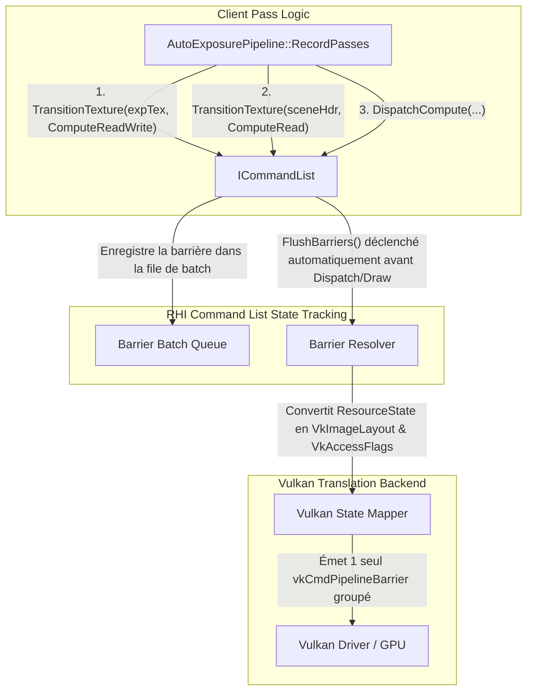

# Plan d'Évolution RHI — Phase 1 : Resource State Tracker & Barrier Batcher Automatique

- **Date** : 17 Août 2026
- **Auteur** : Antigravity
- **Projet** : `suckless-vulkan`
- **Composant** : RHI Core (`IRHI`, `ICommandList`, `VulkanRHI`, `VulkanCommandList`)
- **Statut** : 📋 **Spécification Technique & Plan d'Implémentation Détaillé**

______________________________________________________________________

## 1. Problématique & Rationale

Lors de l'implémentation de l'Auto-Exposition, la gestion manuelle des barrières de mémoire (`VkImageMemoryBarrier`) a causé un bug critique (Bug 4) :

- La barrière spécifiait `oldLayout = VK_IMAGE_LAYOUT_UNDEFINED`, ce qui autorisait le driver GPU à purger la mémoire de la texture $1 \\times 1$ `RGBA32F` entre deux frames, cassant l'adaptation temporelle.
- Chaque passe compute devait calculer manuellement les masques d'accès (`VK_ACCESS_SHADER_READ_BIT`, `VK_ACCESS_SHADER_WRITE_BIT`), les étapes de pipeline (`VK_PIPELINE_STAGE_COMPUTE_SHADER_BIT`, `VK_PIPELINE_STAGE_FRAGMENT_SHADER_BIT`), et émettre un appel système `vkCmdPipelineBarrier` isolé par ressource.

### Objectifs de la Phase 1

1. **Élimination totale des barrières manuelles** dans les modules applicatifs (`AutoExposurePipeline`, `BloomPipeline`, `PostProcess`).
1. **State Machine automatique** : Chaque ressource (`ITexture`, `IBuffer`) conserve son état courant (`ResourceState`). Le RHI dérive automatiquement `oldLayout` $\\to$ `newLayout`, `srcAccessMask` $\\to$ `dstAccessMask`, et `srcStageMask` $\\to$ `dstStageMask`.
1. **Barrier Batching** : Regroupement de toutes les transitions de ressources d'une passe en un **unique appel `vkCmdPipelineBarrier`**, réduisant l'overhead CPU de soumission Vulkan.

______________________________________________________________________

## 2. Conception de l'Architecture



______________________________________________________________________

## 3. Spécification des Types & Interfaces

### 3.1 Énumération `ResourceState` (`src/rhi/rhi_types.h`)

```cpp
enum class ResourceState : uint32_t {
    Undefined          = 0,
    Common             = 1 << 0,
    VertexBuffer       = 1 << 1,
    IndexBuffer        = 1 << 2,
    UniformBuffer      = 1 << 3,
    ShaderResource     = 1 << 4, // Lecture Fragment/Vertex (SHADER_READ_ONLY_OPTIMAL)
    ComputeShaderRead  = 1 << 5, // Lecture Compute Sampler (SHADER_READ_ONLY_OPTIMAL)
    ComputeShaderWrite = 1 << 6, // Écriture Storage Image / SSBO (GENERAL)
    ComputeReadWrite   = (1 << 5) | (1 << 6),
    RenderTarget       = 1 << 7, // Color Attachment (COLOR_ATTACHMENT_OPTIMAL)
    DepthStencilRead   = 1 << 8, // Depth Read Only (DEPTH_STENCIL_READ_ONLY_OPTIMAL)
    DepthStencilWrite  = 1 << 9, // Depth Write (DEPTH_STENCIL_ATTACHMENT_OPTIMAL)
    TransferSrc        = 1 << 10,
    TransferDst        = 1 << 11,
    Present            = 1 << 12
};
```

### 3.2 Extension de l'interface `ICommandList` (`src/rhi/command_list.h`)

```cpp
class ICommandList {
public:
    virtual ~ICommandList() = default;

    // Transitions déclaratives
    virtual void TransitionTexture(TextureHandle texture, ResourceState newState) = 0;
    virtual void TransitionBuffer(BufferHandle buffer, ResourceState newState) = 0;
    
    // Déclenchement automatique avant tout Draw/Dispatch, ou appel explicite
    virtual void FlushBarriers() = 0;
};
```

### 3.3 Translation Vulkan (`src/rhi/vulkan_state_mapper.h/.cpp`)

Une table de conversion `constexpr` sans branchement associe chaque `ResourceState` aux triplets Vulkan :

```cpp
struct VulkanStateMapping {
    VkImageLayout layout;
    VkAccessFlags accessMask;
    VkPipelineStageFlags stageMask;
};

VulkanStateMapping map_resource_state_to_vulkan(ResourceState state);
```

______________________________________________________________________

## 4. Plan d'Implémentation par Étapes

### 🔹 Étape 1 : Types RHI & Métadonnées de Ressources

- [ ] Ajouter `ResourceState currentState{ResourceState::Undefined};` dans `VulkanTexture` et `VulkanBuffer`.
- [ ] Ajouter `rhi_types.h` définissant l'enum `ResourceState` et ses opérateurs bitwise.
- [ ] Créer `vulkan_state_mapper.cpp` avec la matrice de conversion `map_resource_state_to_vulkan()`.

### 🔹 Étape 2 : Barrier Batcher dans `VulkanCommandList`

- [ ] Ajouter `std::vector<VkImageMemoryBarrier>` et `std::vector<VkBufferMemoryBarrier>` dans `VulkanCommandList`.
- [ ] Dans `TransitionTexture(tex, newState)` :
  - Si `tex->currentState == newState`, retour immédiat (no-op, élimination des barrières redondantes).
  - Si `tex->currentState != newState`, générer la `VkImageMemoryBarrier` avec `oldLayout = map(tex->currentState).layout` et `newLayout = map(newState).layout`, pousser dans le vecteur de batch, puis mettre à jour `tex->currentState = newState`.
- [ ] Dans `FlushBarriers()` :
  - Si aucun barrier en attente, retour immédiat.
  - Sinon, calcul des `srcStageMask` et `dstStageMask` globaux par OR binaire, et soumission d'un **unique** `vkCmdPipelineBarrier`.

### 🔹 Étape 3 : Tests Unitaires & Validation Déterministe

- [ ] Test unitaire RHI `test_resource_state_tracker` dans `tests/test_logic.cpp` :
  - Vérifier la détection de transitions no-op (0 barrières émises si état identique).
  - Vérifier la conservation de l'état précédent (pas de layout `UNDEFINED` après la première transition).
  - Vérifier le regroupement batché de 3 textures en 1 seul appel `vkCmdPipelineBarrier`.

### 🔹 Étape 4 : Refactoring de l'Auto-Exposition (`AutoExposurePipeline`)

- [ ] Remplacer les 40 lignes de barrières manuelles dans `src/vk_engine_autoexposure.cpp` par les appels déclaratifs :

```cpp
cmd->TransitionTexture(engine->autoexposure.exposureTexture.get(), ResourceState::ComputeReadWrite);
cmd->TransitionBuffer(engine->autoexposure.histogramBuffer.get(), ResourceState::ComputeReadWrite);
cmd->FlushBarriers();
```

- [ ] Vérifier que `test_autoexposure_synthetic` et `just test-all` passent à 100%.

______________________________________________________________________

## 5. Critères de Succès & KPIs

| Critère | Objectif | Méthode de Mesure |
| :--- | :--- | :--- |
| **Sécurité Mémoire** | 0 discard involontaire de textures persistantes | Test unitaire + RenderDoc inspection |
| **Appels `vkCmdPipelineBarrier`** | Réduction de $\\approx 70%$ des appels isolés (batching) | Profiling Tracy / RenderDoc API trace |
| **Lignes de Code Barrières** | $-85%$ de lignes de code dans les modules de post-traitement | Analyse `cloc` sur `vk_engine_autoexposure.cpp` |
| **Non-Régression** | 100% PASS sur la suite de tests complète | `just check && just test-all && just test-asan` |
