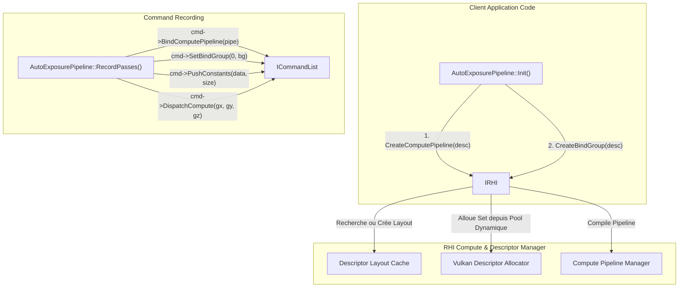

# Plan d'Évolution RHI — Phase 2 : Abstraction Compute Pipelines & BindGroups Déclaratifs

- **Date** : 17 Août 2026
- **Auteur** : Antigravity
- **Projet** : `suckless-vulkan`
- **Composant** : RHI Core (`IRHI`, `ICommandList`, `VulkanRHI`, `VulkanCommandList`)
- **Statut** : 📋 **Spécification Technique & Plan d'Implémentation Détaillé**

______________________________________________________________________

## 1. Problématique & Rationale

Actuellement, chaque module compute (`AutoExposurePipeline`, `BloomPipeline`) gère à la main son propre écosystème de descripteurs Vulkan :

- Création de `VkDescriptorSetLayout` via `VkDescriptorSetLayoutBinding`.
- Création de `VkPipelineLayout` avec `VkPushConstantRange`.
- Création et maintenance de `VkDescriptorPool` dédiés.
- Allocation `vkAllocateDescriptorSets` et écriture manuelle `vkUpdateDescriptorSets` avec `VkDescriptorImageInfo` et `VkDescriptorBufferInfo`.
- Création de `VkComputePipeline` via `vkCreateComputePipelines`.

Cette duplication de code génère plus de **250 lignes de boilerplate technique par module** et augmente le risque de bugs silencieux (ex: Bug 3 de fallback sur `materialBuffer`).

### Objectifs de la Phase 2

1. **API Moderne & Déclarative** inspirée de WebGPU / D3D12 (`IBindGroup`, `IBindGroupLayout`, `IComputePipeline`).
1. **Descriptor Allocator & Cache Automatique** : Le RHI gère le pool de descripteurs et met en cache les layouts identiques pour éviter les doublons.
1. **Refactorisation Majeure** :
   - `src/vk_engine_autoexposure.cpp` : Réduction de **320 à \<100 lignes**.
   - `src/vk_engine_bloom.cpp` : Remplacement des 9 sets manuels par des BindGroups instanciés dynamiquement.

______________________________________________________________________

## 2. Conception de l'Architecture



______________________________________________________________________

## 3. Spécification des Types & Nouvelles Interfaces

### 3.1 Descripteurs de BindGroup (`src/rhi/rhi_types.h`)

```cpp
enum class BindingType : uint8_t {
    Sampler,
    SampledTexture,
    StorageTexture,
    UniformBuffer,
    StorageBuffer
};

struct BindGroupEntry {
    uint32_t binding;
    BindingType type;
    TextureHandle texture{nullptr};
    BufferHandle buffer{nullptr};
    uint64_t offset{0};
    uint64_t size{0};
};

struct BindGroupDesc {
    std::string_view debugName;
    std::vector<BindGroupEntry> entries;
};
```

### 3.2 Descripteurs de Compute Pipeline (`src/rhi/rhi_types.h`)

```cpp
struct ComputePipelineDesc {
    std::string_view debugName;
    std::string_view shaderPath; // Chemin SPIR-V
    std::vector<BindGroupLayoutDesc> bindGroupLayouts;
    uint32_t pushConstantsSize{0};
};
```

### 3.3 Nouvelles méthodes `IRHI` & `ICommandList`

```cpp
class IRHI {
public:
    // ... existant ...

    virtual IComputePipeline* CreateComputePipeline(const ComputePipelineDesc& desc) = 0;
    virtual IBindGroup* CreateBindGroup(const BindGroupDesc& desc) = 0;
    virtual void DestroyComputePipeline(IComputePipeline* pipeline) = 0;
    virtual void DestroyBindGroup(IBindGroup* bindGroup) = 0;
};

class ICommandList {
public:
    // ... existant ...

    virtual void BindComputePipeline(IComputePipeline* pipeline) = 0;
    virtual void SetBindGroup(uint32_t setIndex, IBindGroup* bindGroup) = 0;
    virtual void PushConstants(const void* data, uint32_t size, uint32_t offset = 0) = 0;
    virtual void DispatchCompute(uint32_t groupCountX, uint32_t groupCountY, uint32_t groupCountZ) = 0;
};
```

______________________________________________________________________

## 4. Exemple de Refactorisation du Code Client

### Avant (320 lignes Vulkan directes dans `vk_engine_autoexposure.cpp`)

- 60 lignes pour créer `VkDescriptorSetLayout`
- 30 lignes pour créer `VkPipelineLayout`
- 50 lignes pour allouer le pool et les sets
- 40 lignes pour écrire `VkWriteDescriptorSet`
- 40 lignes pour créer `VkComputePipeline`
- 50 lignes d'appels `vkCmdBindDescriptorSets`, `vkCmdPushConstants`, `vkCmdDispatch`

### Après (35 lignes de pure logique RHI)

```cpp
GfxResult AutoExposurePipeline::Init(IRHI* rhi) {
    // 1. Pipeline Histogramme
    histogramPipeline = rhi->CreateComputePipeline({
        .debugName = "AutoExposure Histogram",
        .shaderPath = "shaders/autoexposure_histogram.spv",
        .bindGroupLayouts = { { .bindings = { {0, BindingType::SampledTexture}, {1, BindingType::StorageBuffer} } } },
        .pushConstantsSize = sizeof(AutoExposureHistogramPushConstants)
    });

    // 2. BindGroup Histogramme
    histogramBindGroup = rhi->CreateBindGroup({
        .debugName = "AutoExposure Histogram BindGroup",
        .entries = {
            { .binding = 0, .type = BindingType::SampledTexture, .texture = sceneHdrTexture },
            { .binding = 1, .type = BindingType::StorageBuffer, .buffer = histogramBuffer.get() }
        }
    });

    return GfxResult::Success;
}

void AutoExposurePipeline::RecordPasses(ICommandList* cmd, uint32_t width, uint32_t height, float deltaTime) {
    // Passe 1 : Histogram
    cmd->TransitionTexture(sceneHdrTexture, ResourceState::ComputeShaderRead);
    cmd->TransitionBuffer(histogramBuffer.get(), ResourceState::ComputeShaderWrite);
    cmd->BindComputePipeline(histogramPipeline);
    cmd->SetBindGroup(0, histogramBindGroup);
    cmd->PushConstants(&histPushConstants, sizeof(histPushConstants));
    cmd->DispatchCompute((width + 15) / 16, (height + 15) / 16, 1);

    // Passe 2 : Adapt
    cmd->TransitionBuffer(histogramBuffer.get(), ResourceState::ComputeShaderRead);
    cmd->TransitionTexture(exposureTexture.get(), ResourceState::ComputeReadWrite);
    cmd->BindComputePipeline(adaptPipeline);
    cmd->SetBindGroup(0, adaptBindGroup);
    cmd->PushConstants(&adaptPushConstants, sizeof(adaptPushConstants));
    cmd->DispatchCompute(1, 1, 1);
}
```

______________________________________________________________________

## 5. Plan d'Implémentation par Étapes

### 🔹 Étape 1 : Infrastructure RHI (`VulkanDescriptorAllocator` & `VulkanDescriptorCache`)

- [ ] Créer `src/rhi/vulkan_descriptor_allocator.h/.cpp` : Gestionnaire de pools de descripteurs à croissance dynamique.
- [ ] Créer `src/rhi/vulkan_descriptor_cache.h/.cpp` : Hashmap des `VkDescriptorSetLayout` pour éviter la duplication.

### 🔹 Étape 2 : Implémentation `VulkanComputePipeline` & `VulkanBindGroup`

- [ ] Implémenter `VulkanComputePipeline` encapsulant `VkPipelineLayout` et `VkPipeline`.
- [ ] Implémenter `VulkanBindGroup` encapsulant `VkDescriptorSet`.
- [ ] Connecter `IRHI::CreateComputePipeline` et `IRHI::CreateBindGroup`.

### 🔹 Étape 3 : Command Recording dans `VulkanCommandList`

- [ ] Implémenter `BindComputePipeline()`, `SetBindGroup()`, `PushConstants()`, `DispatchCompute()`.
- [ ] Gestion automatique du flushing des barrières (`FlushBarriers()`) avant chaque dispatch.

### 🔹 Étape 4 : Refactoring & Tests

- [ ] Refactorer `AutoExposurePipeline` vers la nouvelle API RHI.
- [ ] Vérifier la rétrocompatibilité et exécuter `test_autoexposure_synthetic` et `just test-all`.
- [ ] Refactorer `BloomPipeline` vers la nouvelle API RHI.
- [ ] Validation complète sous `just check && just test-asan`.

______________________________________________________________________

## 6. Critères de Succès & KPIs

| Critère | Objectif | Méthode de Mesure |
| :--- | :--- | :--- |
| **Réduction Boilerplate** | $-70%$ de lignes dans les modules compute | Analyse `cloc` sur `vk_engine_autoexposure.cpp` et `vk_engine_bloom.cpp` |
| **Nombre de Descriptor Pools** | 1 seul gestionnaire dynamique global RHI | Audit mémoire RenderDoc / VMA |
| **Robustesse & Type Safety** | 0 casting brut `VkDescriptorSet` hors du module RHI | Clang-Tidy static analysis |
| **Non-Régression** | 100% PASS sur la suite de tests complète | `just check && just test-all && just test-asan` |
