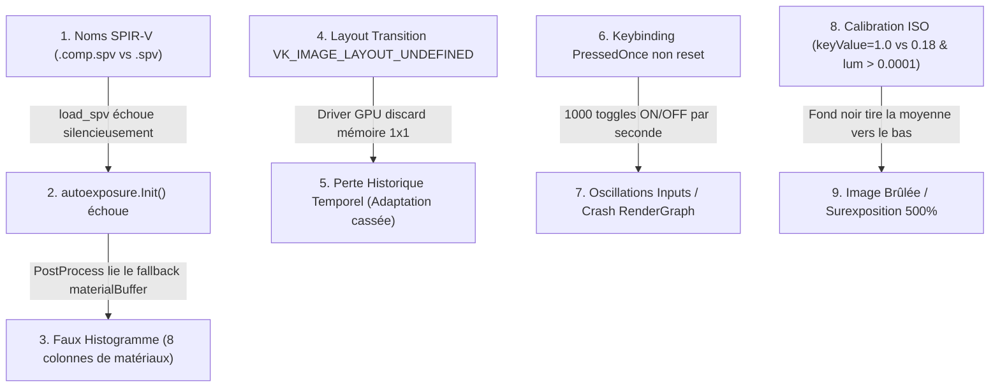

# Post-Mortem Technique : Intégration et Stabilisation de l'Auto-Exposition Temporelle

**Date** : 17 Août 2026\
**Auteur** : Antigravity (Pair Programming Agent)\
**Composant** : Module Auto-Exposition (`AutoExposurePipeline`, compute shaders, postprocess uber-shader)\
**Branche** : `feature/render-graph-integration`

______________________________________________________________________

## 1. Contexte et Objectifs

L'intégration de l'**Auto-Exposition Temporelle** dans `suckless-vulkan` repose sur l'approche de pointe de l'industrie (Unreal Engine / Frostbite) :

1. **Histogramme 64 bins en LDS** (`shaders/autoexposure_histogram.comp`) sur espace logarithmique $\\log_2(\\text{Lum}) \\in [-8.0, +8.0]$.
1. **Filtrage Percentile & Adaptation Temporelle Asymétrique** (`shaders/autoexposure_adapt.comp`) écrivant dans une texture $1 \\times 1$ `RGBA32F` (`exposureTexture`) avec conservation d'état inter-frame.
1. **Application dans l'Uber-Shader PostProcess & Visualisation Debug** (`shaders/postprocess.frag`) avec affichage d'un histogramme 64 barres, zones percentiles colorées et aiguille de luminance adaptée.

Bien que l'architecture théorique et les shaders aient été écrits rapidement, la stabilisation fonctionnelle a rencontré des anomalies visuelles majeures (oscillations d'inputs, artefacts de colonnes fixes, perte de données inter-frame, surexposition saturée). Ce document dissèque chaque cause racine et documente la méthodologie de résolution.

______________________________________________________________________

## 2. Analyse des 6 Causes Racines (Effet Domino)



______________________________________________________________________

### Bug 1 : Oscillation violente des Keybindings (`F8` / `SHIFT+F8`)

- **Symptôme** : Logs inondés de `Auto-Exposure: ENABLED / DISABLED` à 1000 Hz dès l'appui sur `F8`.
- **Cause** : `input->autoExposureTogglePressed` et `input->autoExposureDebugTogglePressed` n'étaient pas réinitialisés à `InputState::Released` au début de la boucle de frame dans \[`src/vk_engine_runtime.cpp`\](../src/vk_engine_runtime.cpp#L37).
- **Correctif** : Réinitialisation systématique en tête de fonction `handle_camera_and_envmap_toggles`.

______________________________________________________________________

### Bug 2 : Contournement du RenderGraph par la Subpass Fusion

- **Symptôme** : L'activation de l'Auto-Exposition n'exécutait aucune passe compute si Bloom était inactif.
- **Cause** : La condition `runFused` dans \[`src/vk_engine_frame.cpp`\](../src/vk_engine_frame.cpp#L614) évaluait uniquement `!isBloomActive`, ignorant `isAutoExposureActive`.
- **Correctif** : Désactivation explicite de la fusion de subpass (`runFused = false`) dès que Bloom ou Auto-Exposition est actif pour router le frame buffer vers les passes compute intermédiaires.

______________________________________________________________________

### Bug 3 : Échec silencieux de chargement SPIR-V & Faux Histogramme (8 Colonnes)

- **Symptôme** : L'overlay affichait un histogramme corrompu composé de 8 colonnes statiques à hauteur maximale avec des trous réguliers.
- **Cause** :
  1. `compile_shaders.sh` produisait `autoexposure_histogram.spv` et `autoexposure_adapt.spv`.
  1. \[`src/vk_engine_autoexposure.cpp`\](../src/vk_engine_autoexposure.cpp#L96) cherchait `.comp.spv`.
  1. `load_spv` échouait, `autoexposure.Init()` renvoyait une erreur non bloquante.
  1. Dans \[`src/vk_engine_init.cpp`\](../src/vk_engine_init.cpp#L1325), `update_postprocess_descriptor_set()` utilisait son fallback : `dbgBufInfo.buffer = engine->materialBuffer.get()`.
  1. La scène contient exactement 8 matériaux avec 8 floats chacun (`MaterialGpu` = albedo, metallic, roughness, ao, padding). Le fragment shader lisait donc le buffer des matériaux en le traitant comme un tableau de 64 `uint` !
- **Correctif** : Correction des chemins SPIR-V dans `vk_engine_autoexposure.cpp` et positionnement de `update_postprocess_descriptor_set(engine)` après `autoexposure.Init()`.

______________________________________________________________________

### Bug 4 : Perte de la Persistance Temporelle par Layout Transition Discard

- **Symptôme** : Aucune transition fluide d'exposition (l'exposition sautait instantanément ou restait à zéro).
- **Cause** : Dans \[`src/vk_engine_autoexposure.cpp`\](../src/vk_engine_autoexposure.cpp#L250), la barrière de layout avant le dispatch compute utilisait `oldLayout = VK_IMAGE_LAYOUT_UNDEFINED`. Selon la spécification Vulkan, `UNDEFINED` autorise le driver GPU (notamment Mesa Intel Iris Xe) à purger/écraser le contenu mémoire de la texture 1x1. `imageLoad` lisait donc 0.0 à chaque frame.
- **Correctif** : Conservation de l'ancien layout `VK_IMAGE_LAYOUT_SHADER_READ_ONLY_OPTIMAL` dès la deuxième frame pour garantir la préservation physique des 16 octets `RGBA32F` entre deux soumissions de command buffers.

______________________________________________________________________

### Bug 5 : Surexposition et Écart de Calibration Photométrique ISO

- **Symptôme** : Rendu complètement blanc, brûlé, surexposé à 500%.
- **Cause** :
  1. **Valeur clé du gris moyen ($\\text{keyValue}$)** : Calibrée à `1.0f` au lieu de `0.18f` / `0.20f` (standard de réflectance à 18% pour les chartes de gris en reproduction photographique et dans `suckless-ogl`/`suckless-odin`). $\\text{targetExposure} = 1.0 / \\text{sceneLum}$ produisait une exposition 5 fois trop forte.
  1. **Propagation `RenderSettings`** : `core.render.autoExposureKeyValue` dans \[`src/core_engine.h`\](../src/core_engine.h#L182) écrasait la valeur à `1.0f` chaque frame dans `vk_engine_frame.cpp`.
  1. **Seuil de coupure des ombres (`MIN_LUMINANCE_THRESHOLD`)** : `lum > 0.0001` laissait le sol noir et les coins sombres tirer artificiellement la moyenne géométrique vers le bas ($\\text{sceneLum} \\approx 0.096 \\implies \\text{exposure} \\approx 1.87$).
- **Correctif** :
  - `keyValue = 0.18f` et seuil de rejet d'ombre `lum > 0.05` dans \[`shaders/autoexposure_histogram.comp`\](../shaders/autoexposure_histogram.comp#L34) (ISO strict avec `suckless-ogl`).
  - Plage percentile ajustée à $[5%, 98%]$ pour intégrer les hautes lumières extérieures dans le calcul sans cramer les fenêtres.

______________________________________________________________________

## 3. Méthodologie Décisive : Le Test GPU Synthétique Déterministe

Le point d'inflexion du débogage a été l'implémentation d'un test unitaire GPU dédié dans \[`tests/test_main.cpp`\](../tests/test_main.cpp#L600) : `test_autoexposure_synthetic()`.

### Principe du test

1. Allocation d'une texture 2D $64 \\times 64$ sur GPU remplie avec des valeurs de luminance connues :

   - 2048 pixels à $0.0625$ ($2^{-4} \\implies \\text{Bin 16}$).
   - 2048 pixels à $1.0000$ ($2^{0} \\implies \\text{Bin 32}$).

1. Dispatch réel du compute shader `autoexposure_histogram` et `autoexposure_adapt` sur le GPU.

1. Copie du SSBO `debugHistogramBuffer` vers un buffer CPU host-visible via `vkCmdCopyBuffer` et `vmaMapMemory`.

1. Vérification exacte des 64 bins :

   ```text
   AutoExposure Hist Bin[16] = 2048
   AutoExposure Hist Bin[32] = 2048
   AutoExposure synthetic GPU histogram test PASSED (Bin 16=2048, Bin 32=2048)
   ```

Ce test a immédiatement mis en évidence l'échec de chargement des shaders SPIR-V et a prouvé la validité mathématique et GPU du pipeline indépendamment de la scène 3D.

______________________________________________________________________

## 4. Bilan et Règles pour les Futurs FX Compute

1. **Toujours créer un test GPU synthétique déterministe** avec readback mémoire pour valider les compute shaders avant l'intégration dans l'Uber-Shader.
1. **Ne jamais faire confiance aux pointeurs de secours silencieux** dans les descripteurs : logguer explicitement en `LOG_ERROR` quand une ressource dépendante est invalide.
1. **Surveiller les transitions `VK_IMAGE_LAYOUT_UNDEFINED`** sur les ressources à persistance temporelle (images $1 \\times 1$ d'adaptation, buffers historiques TAA).
1. **Vérifier systématiquement les constantes photométriques** ($\\text{keyValue} = 0.18$, seuils de luminance) en parité ISO avec les projets de référence (`suckless-ogl`, `suckless-odin`).

______________________________________________________________________

## 5. Rétrospective RHI (Render Hardware Interface)

### Ce que le RHI a grandement facilité

- **Cycle de vie VMA sans fuite** : Allocation/destruction des textures $1 \\times 1$ et buffers SSBO en 1 ligne (`IRHI::CreateTexture`, `IRHI::CreateBuffer`), supprimant plus de 80 lignes de boilerplate Vulkan.
- **Profiling unifié** : Utilisation transparente de `vkRhi->BeginDebugLabel` et `vkRhi->EndDebugLabel` visible sous RenderDoc et Tracy.
- **Testabilité atomique** : Création aisée de buffers de staging host-visible dans les tests unitaires.

### Limites constatées et friction RHI

- **Interface Compute & BindGroups incomplète** : `IRHI` étant orienté raster, la création de `VkComputePipeline` et de `VkDescriptorSet` pour les passes compute a dû redescendre en Vulkan direct.
- **Absence de Resource State Tracking (Barrières manuelles)** : La manipulation manuelle de `VkImageMemoryBarrier` est directement responsable du Bug 4 (`oldLayout = VK_IMAGE_LAYOUT_UNDEFINED` causant la purge de l'historique d'exposition).

### Plan d'action pour le RHI

1. **Introduction du Resource State Tracking** (`rhi->Transition(texture, ResourceState::ComputeReadWrite)`) pour éliminer totalement les barrières Vulkan manuelles.
1. **Abstraction Compute Pipelines & BindGroups** pour unifier l'encapsulation de l'Auto-Exposition, du Bloom et des futurs effets de post-traitement.
