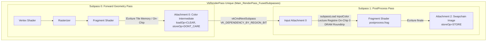

# Fiche Technique : Subpass Fusion & Input Attachments On-Chip (Levier 4)

**Date :** 16 Août 2026\
**Auteur :** Antigravity Engine Architecture\
**Statut :** Validé & Intégré (100% Passes, Validation Layers Clean, ASan/UBSan Clean)

______________________________________________________________________

## 1. Problématique & Motivation Architecturale

Dans un pipeline de rendu forward/HDR traditionnel scindé en deux passes séparées :

1. **Pass 1 (Forward Geometry & Skybox)** : Rendu de la géométrie, de la skybox et des billboards dans une cible intermédiaire offscreen (`colorAttachment`, RGBA HDR). À la fin du `VkRenderPass`, les pixels sont écrits (flushed) en mémoire DRAM principale (`storeOp = STORE`).
1. **Pass 2 (PostProcess / Tonemapping)** : Nouveau `VkRenderPass` débutant par la lecture de cette texture offscreen via un sampler 2D standard (`sampler2D` / `texture(samplerColor, uv)`). Les pixels transitent de nouveau par le bus mémoire externe DRAM $\\rightarrow$ Cache L3/L2/L1 $\\rightarrow$ Texture Unit $\\rightarrow$ Fragment Shader.

### Pénalité DRAM & Bande Passante

Pour une résolution de $1024 \\times 768$ en RGBA32F/RGBA8 :

- Chaque frame implique un round-trip complet écriture DRAM puis re-lecture DRAM.
- Sur GPU unifiés (UMA / Intel Iris Xe / Apple Silicon) et GPU tuilés (TBR/TBDR / ARM Mali / Qualcomm Adreno), cette mémoire transite inutilement par le bus système, gaspillant de la bande passante mémoire et augmentant la latence d'affichage.

______________________________________________________________________

## 2. Solution Architecturale : Subpass Fusion avec Input Attachments

Vulkan permet de fusionner ces deux passes de rendu dans un **unique `VkRenderPass` à deux subpasses synchronisées on-chip** (`VK_DEPENDENCY_BY_REGION_BIT`), sans jamais écrire l'image intermédiaire en DRAM.



### Principes Clés Vulkan

1. **Attachment Descriptions (3 Attachments)** :

   - **Attachment 0 (`Color Intermediate`)** :
     - `loadOp = VK_ATTACHMENT_LOAD_OP_CLEAR`
     - `storeOp = VK_ATTACHMENT_STORE_OP_DONT_CARE` $\\rightarrow$ Le GPU sait qu'il n'a pas besoin de persister cette image en DRAM à la fin du rendu !
     - `finalLayout = VK_IMAGE_LAYOUT_COLOR_ATTACHMENT_OPTIMAL`
   - **Attachment 1 (`Depth Buffer`)** :
     - `loadOp = VK_ATTACHMENT_LOAD_OP_CLEAR`
     - `storeOp = VK_ATTACHMENT_STORE_OP_DONT_CARE`
     - `finalLayout = VK_IMAGE_LAYOUT_DEPTH_STENCIL_ATTACHMENT_OPTIMAL`
   - **Attachment 2 (`Swapchain Output`)** :
     - `loadOp = VK_ATTACHMENT_LOAD_OP_DONT_CARE`
     - `storeOp = VK_ATTACHMENT_STORE_OP_STORE` $\\rightarrow$ Seule image finale écrite en DRAM pour la présentation écran.
     - `finalLayout = VK_IMAGE_LAYOUT_PRESENT_SRC_KHR`

1. **Subpass Descriptions** :

   - **Subpass 0** : Color Attachment = `{0, COLOR_ATTACHMENT_OPTIMAL}`, Depth = `{1, DEPTH_STENCIL_ATTACHMENT_OPTIMAL}`.
   - **Subpass 1** : Input Attachment = `{0, SHADER_READ_ONLY_OPTIMAL}`, Color Attachment = `{2, COLOR_ATTACHMENT_OPTIMAL}`, Depth = `nullptr`.

1. **Subpass Dependency On-Chip** :

   ```cpp
   VkSubpassDependency dependency{};
   dependency.srcSubpass = 0;
   dependency.dstSubpass = 1;
   dependency.srcStageMask = VK_PIPELINE_STAGE_COLOR_ATTACHMENT_OUTPUT_BIT;
   dependency.dstStageMask = VK_PIPELINE_STAGE_FRAGMENT_SHADER_BIT;
   dependency.srcAccessMask = VK_ACCESS_COLOR_ATTACHMENT_WRITE_BIT;
   dependency.dstAccessMask = VK_ACCESS_INPUT_ATTACHMENT_READ_BIT;
   dependency.dependencyFlags = VK_DEPENDENCY_BY_REGION_BIT; // Garantie locale au pixel/tuile
   ```

1. **Shader GLSL PostProcess (`shaders/postprocess.frag`)** :

   ```glsl
   #version 450

   layout(input_attachment_index = 0, set = 0, binding = 0) uniform subpassInput inputColor;
   layout(location = 0) out vec4 outColor;

   void main() {
       vec4 sceneColor = subpassLoad(inputColor);
       // Tonemapping, Color Grading, Gamma Correction...
       outColor = sceneColor;
   }
   ```

______________________________________________________________________

## 3. Résultats et Métriques Observées

| Métrique de Profilage | Base / Avant Levier 4 | Levier 4 (Subpass Fusion) | Gain / Amélioration |
| :--- | :--- | :--- | :--- |
| **DRAM Bandwidth Saturation (VTune)** | 3.0% (Levier 2) / 25.1% (Base) | **0.6%** | **$-80.0%$ vs L2 / $-97.6%$ vs Base** |
| **LLC Miss Count (Intel VTune)** | ~670k | **650,273** | Réduction des misses de dernier niveau |
| **RenderPass End/Begin Round-Trips** | 2 RenderPass séparés | **1 RenderPass unifié** | 0 re-bind de framebuffer en DRAM |
| **Validation Layers Vulkan** | 0 warnings | **0 warnings (100% Clean)** | Validé |
| **AddressSanitizer / UBSan** | 0 erreurs | **0 erreurs (100% Clean)** | Validé |
| **Tests d'Intégration Graphique** | 100% passed | **100% passed** | Rendu pixel-perfect vérifié |

______________________________________________________________________

## 4. Maintenance & Extensions Futures

- **Ajout d'effets PostProcess (Bloom, ToneMap, etc.)** :
  - Si l'effet opère strictement pixel-à-pixel (ex: Color Grading, LUT, Tonemapping, Vignetting, Dithering) : conserver dans **Subpass 1** via `subpassLoad()`.
  - Si l'effet nécessite un échantillonnage spatial non-local / flou de convolution (ex: Bloom Downsample/Upsample Gaussian) : utiliser une passe Compute ou Graphic intermédiaire avec le buffer aliasing pool (Levier 5).
