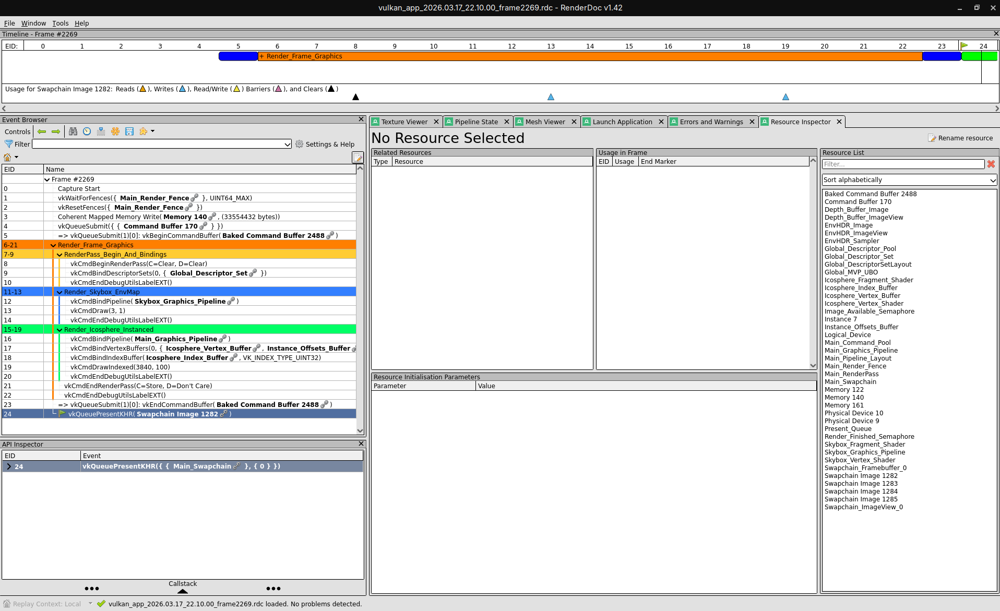

# 🛠️ Tracing & Analyse (RenderDoc)

Cette page documente le workflow RenderDoc du projet, la convention de naming des objets Vulkan, et la decomposition des passes pour faciliter l'analyse frame par frame.

## 1. Setup rapide

Pour une capture exploitable, preferer une build Debug avec symboles:

```bash
just build-debug
just renderdoc_bin=/path/to/qrenderdoc renderdoc
```

Pour une lecture shader plus lisible en Pixel Debugger (moins de desassemblage brut), utiliser le profil shaders debug:

```bash
just renderdoc_bin=/path/to/qrenderdoc renderdoc-debug-shaders
```

Ce profil compile les shaders avec debug info et sans optimisations agressives:

- `glslc`: `-g -O0`

- `glslangValidator` (fallback): `-g -Od`

- Binaire cible: `build/debug/vulkan_app`

- Capture typique: touche `F12` depuis RenderDoc (ou hotkey configuree)

Si RenderDoc n'affiche encore que du desassemblage, verifier que la capture a bien ete faite apres compilation via `renderdoc-debug-shaders`.

## 2. Instrumentation active (VK_EXT_debug_utils)

Le moteur utilise `VK_EXT_debug_utils` pour nommer les ressources et segmenter les commandes GPU.

### 2.1 Naming des ressources principales

Exemples visibles dans le Resource Inspector:

- Pipelines: `Main_Graphics_Pipeline`, `Skybox_Graphics_Pipeline`
- Shader modules: `Icosphere_Vertex_Shader`, `Icosphere_Fragment_Shader`, `Skybox_Vertex_Shader`, `Skybox_Fragment_Shader`
- Buffers: `Icosphere_Vertex_Buffer`, `Icosphere_Index_Buffer`, `Instance_Offsets_Buffer`, `Global_MVP_UBO`
- Images et vues: `Main_Swapchain`, `Swapchain_ImageView_<index>`, `Depth_Buffer_Image`, `Depth_Buffer_ImageView`, `EnvHDR_Image`, `EnvHDR_ImageView`
- Descripteurs: `Global_DescriptorSetLayout`, `Global_Descriptor_Pool`, `Global_Descriptor_Set`
- Sync/queues: `Graphics_Queue`, `Present_Queue`, `Image_Available_Semaphore`, `Render_Finished_Semaphore`, `Main_Render_Fence`
- Ressources temporaires: `*_Staging_Buffer`, `*_Staging_CommandBuffer`, `EnvHDR_Transfer_CommandBuffer`

### 2.2 Labels RenderDoc (decomposition des passes)

Dans l'Event Browser, la frame est structuree par niveaux:

- Parent frame: `Render_Frame_Graphics`
- Preparation render pass: `RenderPass_Begin_And_Bindings`
- Sous-pass skybox/env map: `Render_Skybox_EnvMap`
- Sous-pass geometrie instanciee: `Render_Icosphere_Instanced`
- Upload HDR hors frame principale: `Upload_EnvHDR_Texture`, `Copy_EnvHDR_Staging_To_Image`, `Generate_EnvHDR_Mipmaps`

Cette decomposition permet d'isoler rapidement un cout de draw skybox vs draw geometrie, ou un spike lie a l'upload envmap.

## 3. Capture de reference (frame decomposee)

Image de reference attendue dans la doc:

```text
docs/assets/images/renderdoc_frame_decomposed.png
```



Lecture conseillee sur la capture:

1. Verifier le bloc parent `Render_Frame_Graphics`
1. Verifier la sous-zone `Render_Skybox_EnvMap` (draw 3 vertices fullscreen)
1. Verifier la sous-zone `Render_Icosphere_Instanced` (draw indexed instancie)
1. Controler les ressources nommees dans la liste (pipelines, buffers, image views)

## 4. Protocole de validation VRAM (Full GPU)

Pour confirmer que la geometrie est bien en Device Local:

1. Capturer une frame
1. Filtrer `Icosphere_` dans le Resource Inspector
1. Ouvrir `Icosphere_Vertex_Buffer` puis l'ID memoire associe
1. Verifier `eResDeviceMemory` (correspond a `VK_MEMORY_PROPERTY_DEVICE_LOCAL_BIT`)

## 5. Diagnostic rapide par symptome

- Skybox absente: verifier `Render_Skybox_EnvMap` + pipeline `Skybox_Graphics_Pipeline`
- Geometrie absente: verifier `Render_Icosphere_Instanced` + `Icosphere_*_Buffer`
- Pic ponctuel lors du switch HDR: verifier labels `Upload_EnvHDR_Texture` / `Generate_EnvHDR_Mipmaps`
